# Complete Test Preparation Guide

## Quick Reference: All Key Topics

This comprehensive guide covers all the exam topics with visual aids and key points for effective studying.

### 1. OSI Model Security Overview

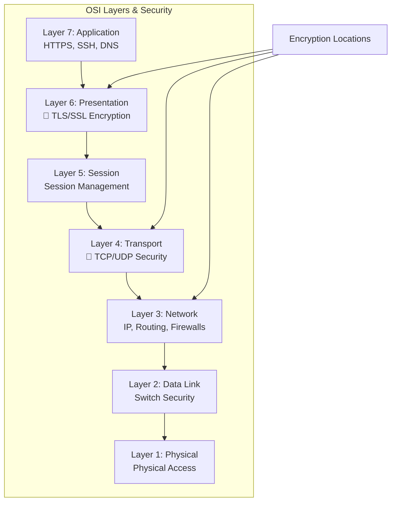

**Key Points:**
- **Presentation Layer (6)**: Main encryption layer (TLS/SSL)
- **Transport Layer (4)**: Secure protocols (HTTPS vs HTTP)
- **Network Layer (3)**: IPSec, VPN tunnels
- **Application Layer (7)**: SSH, DNS security

### 2. UNIX/Linux Security Architecture

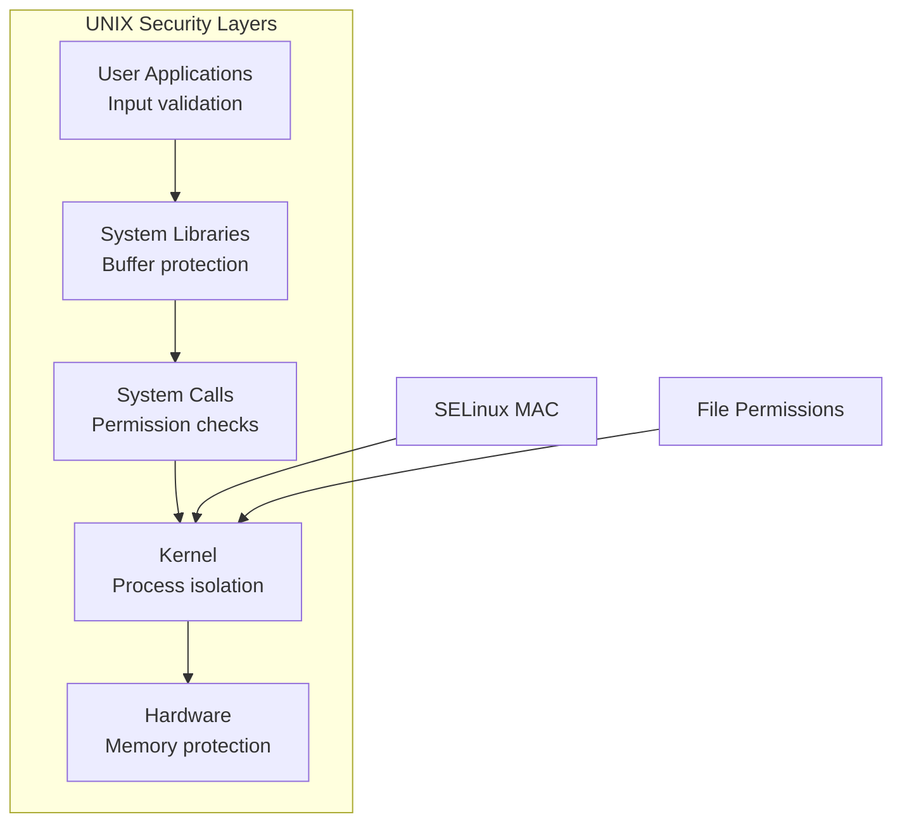

**Security Features:**
- **Process Isolation**: Each process has separate memory space
- **File Permissions**: rwx for owner/group/others
- **SELinux**: Mandatory Access Control beyond traditional permissions
- **System Calls**: Kernel validates all requests

### 3. CIA Triad with Examples

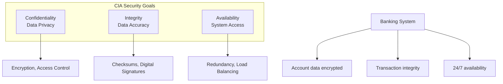

### 4. Network Communication Types

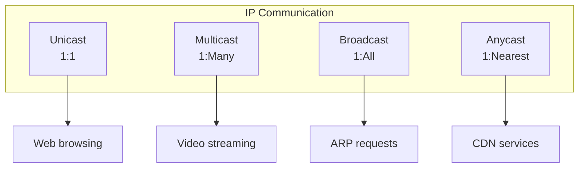

### 5. TCP State Security

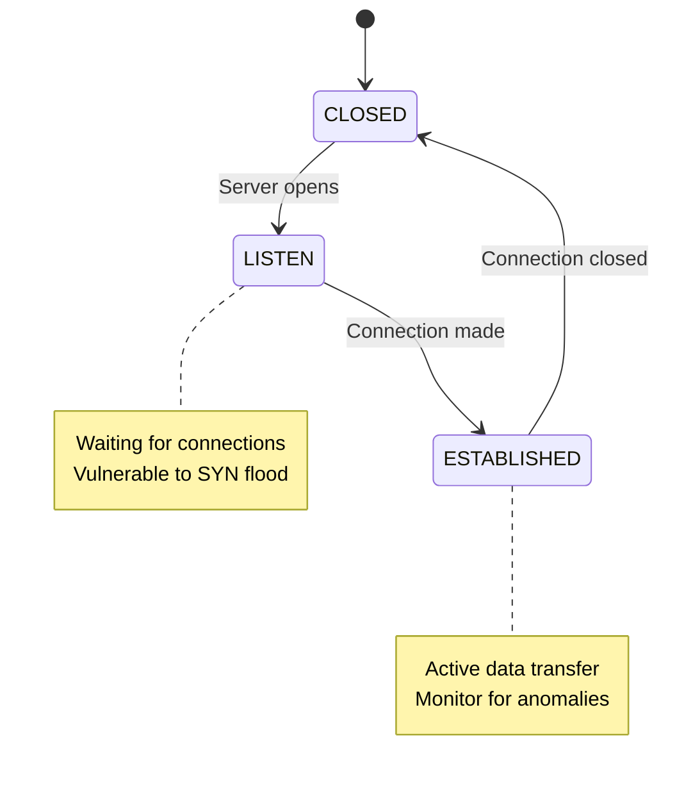

### 6. Important Network Services

| Service | Port | Security Assessment | Key Features |
|---------|------|-------------------|--------------|
| **SSH** | 22 | ✅ Secure | Encrypted, key-based auth |
| **DNS** | 53 | ⚠️ Medium | Use DNSSEC, filtering |
| **HTTP** | 80 | ❌ Insecure | Plaintext - use HTTPS |
| **HTTPS** | 443 | ✅ Secure | TLS encrypted |
| **SMTP** | 25 | ⚠️ Medium | Use STARTTLS |

### 7. Network Calculations

**Subnetting Example:**
```
Question: Is 10.42.143.12 in 10.42.140.0/22?
Answer: YES
Calculation: 10.42.143.12 & 255.255.252.0 = 10.42.140.0
```

**DHCP Process:**
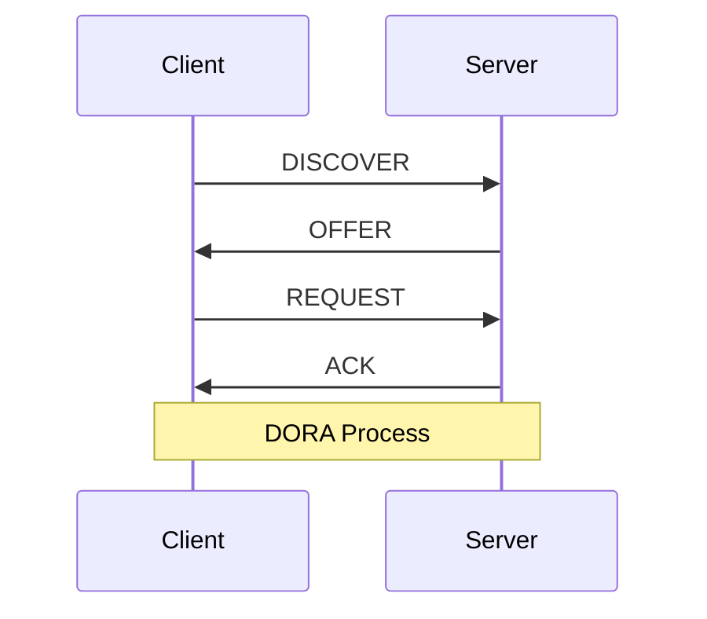

### 8. File System Security

```bash
# Example: Device file analysis
brw-rw-r--. 1 root disk 8, 3 Jun 11 8:57 /dev/sda3
```

**Analysis:**
- `b`: Block device (disk partition)
- `rw-rw-r--`: Read/write for root and disk group
- **Security concern**: Disk group members can access raw disk

**Journaling (ext4):**
- ✅ **Good for security**: Improves data integrity
- ⚠️ **Consideration**: Journal may expose metadata

### 9. LAMP Stack Security

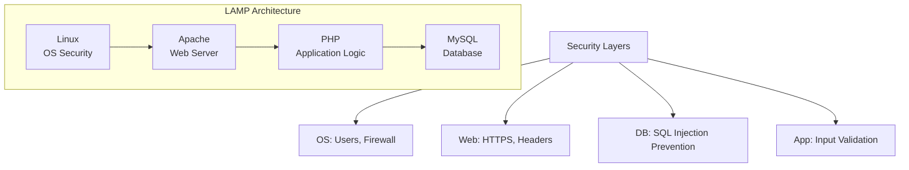

### 10. Web Vulnerabilities

**SQL Injection Prevention:**
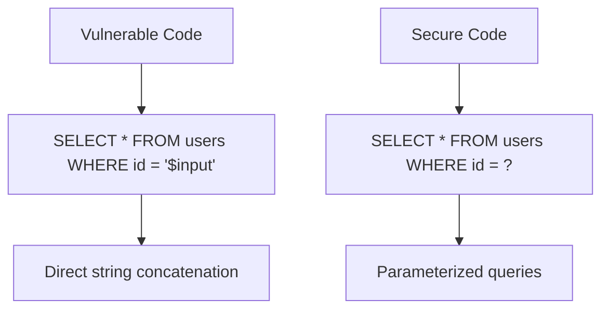

**XSS vs SQL Injection:**
- **SQL Injection**: Targets database, use prepared statements
- **XSS**: Targets browser, use input validation & output encoding

### 11. Encryption Methods

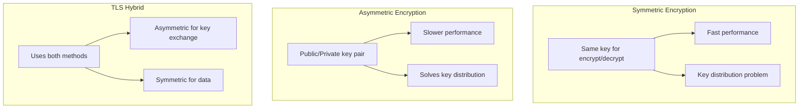

### 12. Authentication vs Authorization

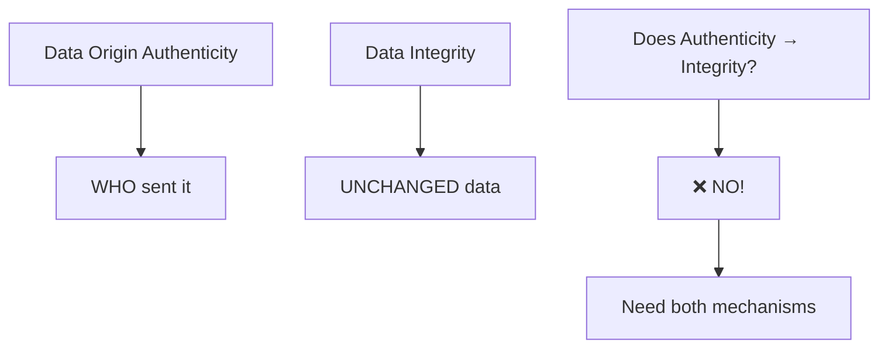

### 13. Cryptographic Concepts

**Nonce vs Salt:**
- **Nonce**: Prevents replay attacks (one-time use)
- **Salt**: Prevents rainbow table attacks (unique per password)

**Alice & Bob:**
- **Alice & Bob**: Legitimate communicating parties
- **Eve**: Passive eavesdropper
- **Mallory**: Active attacker (modifies messages)

### 14. Security Assessment

**CVE System:**
```
CVE-YYYY-NNNN
├── Year of disclosure
└── Sequential number

CVSS Scores:
Critical: 9.0-10.0
High: 7.0-8.9
Medium: 4.0-6.9
Low: 0.1-3.9
```

**PKI Benefits:**
- Identity verification
- Secure communication
- Digital signatures
- Key management

### 15. Powers of Two (Important for Exam)

| Power | Decimal | Hex | Context |
|-------|---------|-----|---------|
| 2^10 | 1,024 | 0x400 | ~1 KB |
| 2^11 | 2,048 | 0x800 | RSA key size |
| 2^12 | 4,096 | 0x1000 | Strong RSA |
| 2^16 | 65,536 | 0x10000 | Port range |
| 2^20 | 1,048,576 | 0x100000 | ~1 MB |
| 2^24 | 16,777,216 | 0x1000000 | Class A |
| 2^32 | 4,294,967,296 | 0x100000000 | IPv4 space |

### 16. CMS vs Static Security

**Why CMS is more vulnerable:**
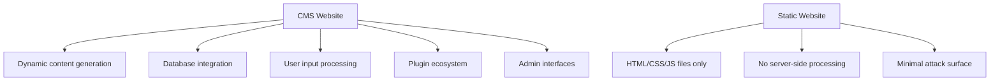

### 17. PHP vs JavaScript Security

**JavaScript is more secure because:**
- Browser sandboxing
- No direct file system access
- Same-origin policy
- Limited server access

**Why we need PHP:**
- Database operations
- Server-side authentication
- File system access
- Business logic protection

### 18. Physical vs Virtual Security

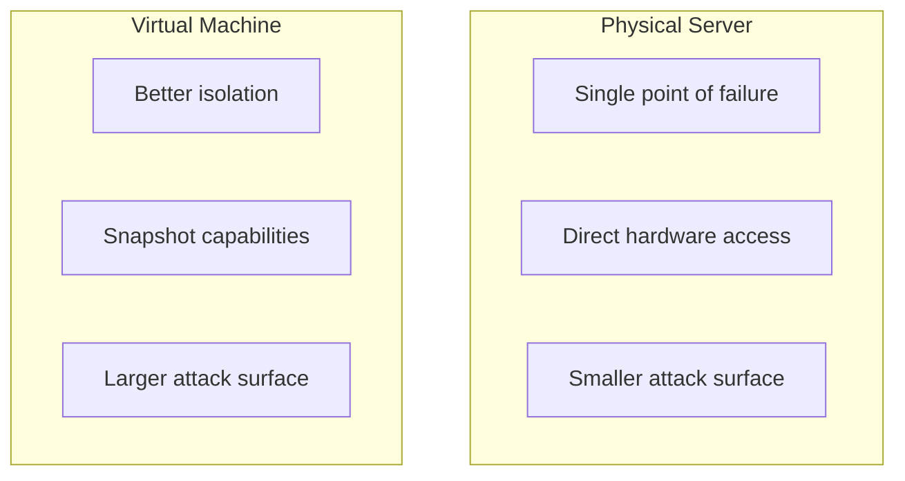

### 19. Windows 10 "Botnet" Analysis

**Arguments FOR:**
- Centralized control by Microsoft
- Extensive telemetry collection
- Forced updates
- Limited user control

**Arguments AGAINST:**
- Legitimate purposes (security, functionality)
- User consent via Terms of Service
- Privacy controls available
- Legal framework compliance

**Conclusion:** Not a traditional botnet, but raises valid privacy concerns about centralized management.

## Final Exam Strategy

### Study Approach

1. **Understand, Don't Memorize**: Focus on concepts and relationships
2. **Practice Calculations**: Network addressing, subnet calculations
3. **Know Security Implications**: For each technology, understand attack vectors
4. **Use Mnemonics**: CIA triad, DORA process, OSI layers
5. **Draw Diagrams**: Visualize network flows and security architectures

### Common Question Patterns

- **"Erläutern Sie..."** (Explain): Provide comprehensive explanations with examples
- **"Nennen Sie..."** (Name): List specific items (ports, protocols, etc.)
- **"Wie verhindert man..."** (How to prevent): Describe security measures
- **"Was ist der Unterschied..."** (What's the difference): Compare technologies/concepts

### Last-Minute Review Checklist

- [ ] OSI layers and encryption locations
- [ ] UNIX security architecture
- [ ] CIA triad with examples
- [ ] Network communication types
- [ ] TCP states and security implications
- [ ] Important port numbers and services
- [ ] Network calculations (subnetting)
- [ ] File system security (permissions, journaling)
- [ ] LAMP stack architecture
- [ ] Web vulnerabilities (SQL injection, XSS)
- [ ] Encryption methods (symmetric/asymmetric)
- [ ] Authentication vs integrity
- [ ] Nonce vs salt
- [ ] CVE/CVSS scoring
- [ ] Powers of two calculations
- [ ] CMS security issues
- [ ] PHP vs JavaScript security
- [ ] Physical vs virtual server security
- [ ] Windows 10 privacy/security analysis

### Test Day Tips

1. **Read Questions Carefully**: Understand what's being asked
2. **Structure Your Answers**: Use clear headings and bullet points
3. **Provide Examples**: Support concepts with practical examples
4. **Address Security Implications**: Always mention security relevance
5. **Manage Time**: Don't spend too long on any single question
6. **Review Answers**: Check for completeness and accuracy

Good luck with your exam! 🍀
