# Cryptography & Security

## Symmetric vs Asymmetric Encryption

Understanding the fundamental differences between encryption methods:

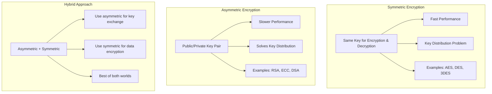

### Encryption Comparison

| Aspect | Symmetric | Asymmetric |
|--------|-----------|------------|
| **Speed** | ✅ Fast | ❌ Slow |
| **Key Management** | ❌ Difficult | ✅ Easy |
| **Scalability** | ❌ Poor | ✅ Good |
| **Use Case** | Data encryption | Key exchange, digital signatures |
| **Key Size** | 128-256 bits | 2048-4096 bits |

## TLS/SSL Encryption Process

### How TLS Combines Both Encryption Types

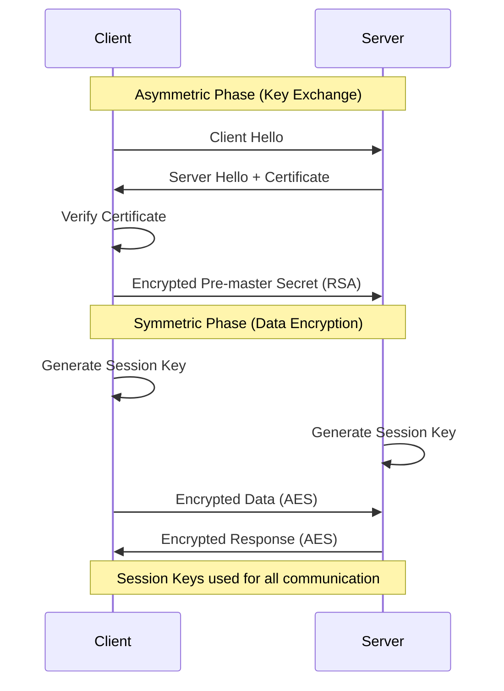

### Why TLS Uses Both Methods

1. **Asymmetric for Key Exchange**: Securely share session keys
2. **Symmetric for Data**: Fast encryption of actual data
3. **Performance**: Balance between security and speed
4. **Scalability**: Each session gets unique keys

## Authentication & Authorization

### Data Origin Authenticity vs Data Integrity

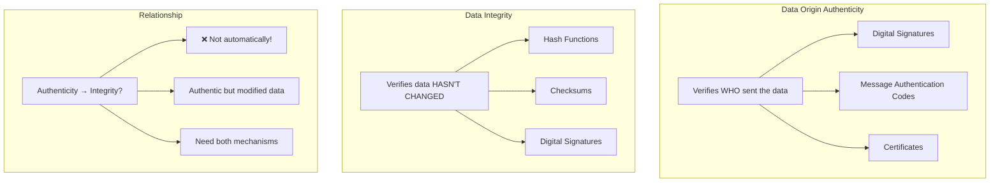

### Key Question: Does Authenticity Imply Integrity?

**Answer: NO, not automatically!**

**Example Scenario:**
- Data is authentically from Alice (verified signature)
- But data was modified in transit after signing
- Authenticity confirmed, but integrity compromised

**Solution:** Use digital signatures that provide both:
- **Authenticity**: Verifies sender identity
- **Integrity**: Detects any modifications

## Nonces vs Salt

Understanding these cryptographic concepts:

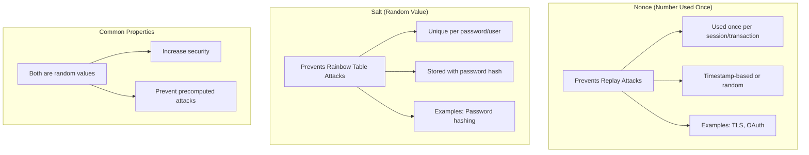

### Use Cases Comparison

| Aspect | Nonce | Salt |
|--------|-------|------|
| **Purpose** | Prevent replay attacks | Prevent rainbow table attacks |
| **Usage** | Session/transaction based | Password hashing |
| **Storage** | Temporary | Permanent (with hash) |
| **Reuse** | Never (within time window) | Different per user |
| **Examples** | TLS handshake, OAuth | bcrypt, PBKDF2 |

### Practical Examples

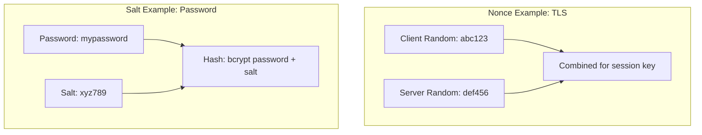

## PKI (Public Key Infrastructure)

### Why Companies Use PKI

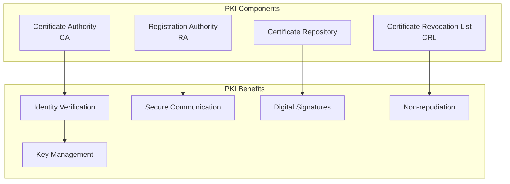

### Corporate PKI Use Cases

1. **Employee Authentication**: Digital certificates for login
2. **Email Security**: S/MIME for encrypted/signed emails
3. **Document Signing**: Digital signatures for contracts
4. **VPN Access**: Certificate-based VPN authentication
5. **Code Signing**: Verify software integrity
6. **Web Security**: SSL/TLS certificates for internal sites

## Security Vulnerabilities Assessment

### CVE (Common Vulnerabilities and Exposures)

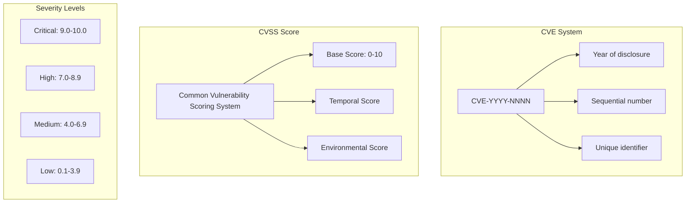

### CVSS Scoring Components

| Component | Description | Factors |
|-----------|-------------|---------|
| **Base Score** | Intrinsic vulnerability characteristics | Attack vector, complexity, privileges required |
| **Temporal Score** | Time-sensitive factors | Exploit availability, remediation level |
| **Environmental Score** | Organization-specific factors | Business impact, system exposure |

### Example: CVE Analysis

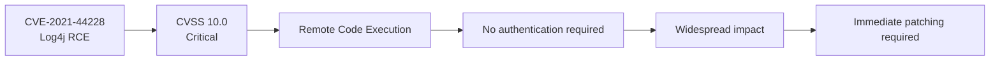

## Trust and Verification

### Software Installation Security

**Question**: How can you ensure OS installation media is genuine?

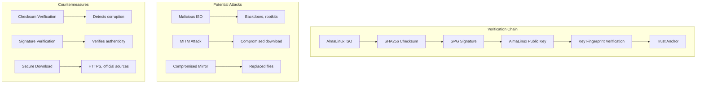

### Trust Chain Process

1. **Download ISO**: From official AlmaLinux website
2. **Verify Checksum**: Compare SHA256 hash
3. **Verify Signature**: Check GPG signature
4. **Verify Key**: Confirm public key fingerprint
5. **Trust Anchor**: AlmaLinux's reputation and processes

### Update Security

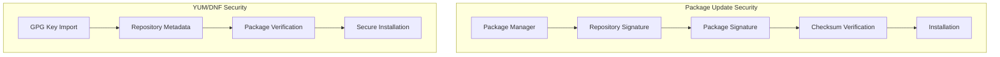

## Cryptographic Actors

### Alice, Bob, Eve, and Mallory

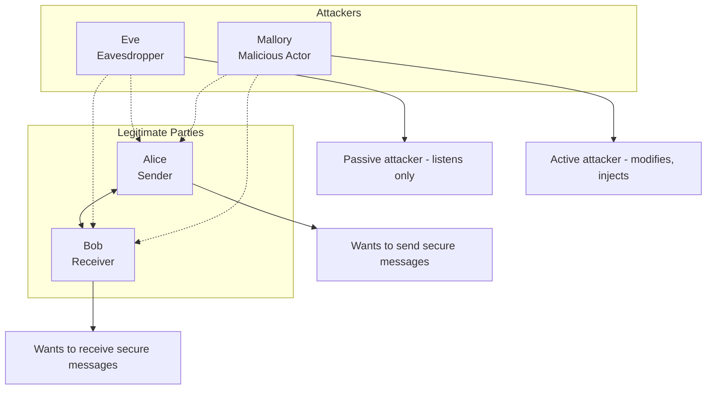

### Why They Have "Streit" (Conflict)

**Eve's Capabilities:**
- **Passive Eavesdropping**: Intercepts communications
- **Traffic Analysis**: Analyzes patterns and metadata
- **Weakness**: Cannot modify messages

**Mallory's Capabilities:**
- **Active Attacks**: Modifies messages in transit
- **Man-in-the-Middle**: Intercepts and relays messages
- **Impersonation**: Pretends to be legitimate party
- **Replay Attacks**: Resends captured messages

## Power-of-Two Calculations

### Important Powers of Two

| Power | Decimal | Hexadecimal | Real-World Context |
|-------|---------|-------------|-------------------|
| 2^10 | 1,024 | 0x400 | ~1 KB |
| 2^11 | 2,048 | 0x800 | Common RSA key size |
| 2^12 | 4,096 | 0x1000 | Strong RSA key size |
| 2^13 | 8,192 | 0x2000 | Very strong RSA key |
| 2^14 | 16,384 | 0x4000 | |
| 2^15 | 32,768 | 0x8000 | |
| 2^16 | 65,536 | 0x10000 | Port number range |
| 2^20 | 1,048,576 | 0x100000 | ~1 MB |
| 2^24 | 16,777,216 | 0x1000000 | IPv4 Class A |
| 2^32 | 4,294,967,296 | 0x100000000 | IPv4 address space |

### Large Powers (Order of Magnitude)

- **2^64**: ~18 quintillion (18 × 10^18)
- **2^128**: ~340 undecillion (3.4 × 10^38) - AES-128 key space

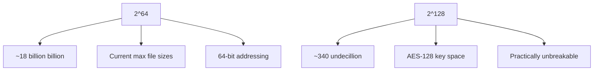

## Test Preparation: Cryptography Checklist

### Key Concepts to Master

- [ ] Symmetric vs Asymmetric encryption differences
- [ ] How TLS combines both encryption types
- [ ] Authenticity vs Integrity relationship
- [ ] Nonce vs Salt use cases
- [ ] PKI components and benefits
- [ ] CVE and CVSS scoring system
- [ ] Trust chain verification process
- [ ] Cryptographic actors and attack types
- [ ] Powers of two and their significance

### Security Principles

1. **Defense in Depth**: Multiple security layers
2. **Least Privilege**: Minimal required access
3. **Fail Secure**: Secure defaults when systems fail
4. **Keep It Simple**: Complexity introduces vulnerabilities
5. **Regular Updates**: Patch known vulnerabilities
6. **Verify Everything**: Trust but verify principle
