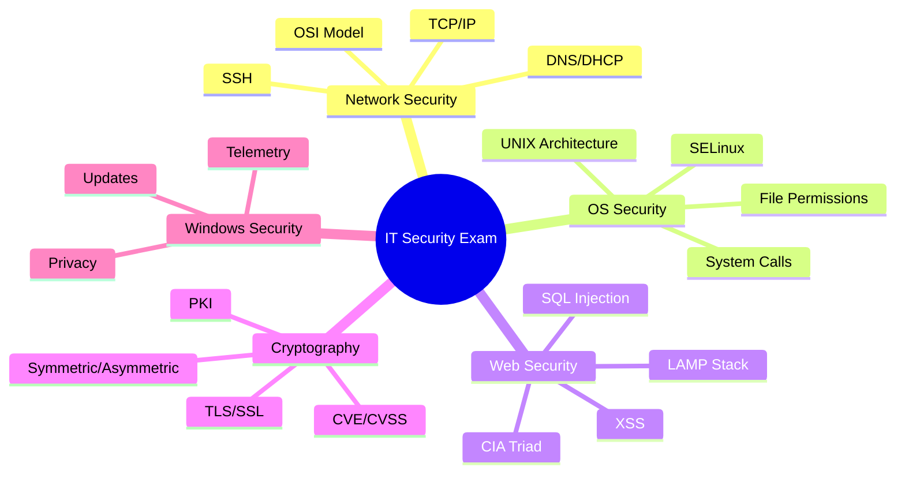

# IT Security Test Preparation

Welcome to your comprehensive IT security study guide! This documentation covers all the essential topics for your upcoming exam.

## Overview

This study guide is designed to help you master the key concepts in IT security and network applications. Each section includes visual diagrams, practical examples, and security implications to enhance your understanding.

## Study Guide Structure

The guide is organized into the following sections:

### 🌐 [Network Fundamentals & Security](./network-fundamentals.md)
- OSI Model and security at each layer
- IP communication types (Unicast, Multicast, Broadcast, Anycast)
- TCP states and security implications
- DNS, DHCP, and SSH security
- Network calculations and subnetting
- Port security and important services

### 💻 [Operating System Security](./operating-system-security.md)
- UNIX/Linux security architecture
- File system security and permissions
- SELinux and mandatory access control
- Device security and system calls
- Memory protection mechanisms
- User and group management

### 🔒 [Web Security & LAMP Stack](./web-security-lamp.md)
- CIA Triad (Confidentiality, Integrity, Availability)
- LAMP architecture and security
- HTTP vs HTTPS security comparison
- Web vulnerabilities (SQL injection, XSS)
- CMS security issues
- PHP vs JavaScript security analysis

### 🔐 [Cryptography & Security](./cryptography-security.md)
- Symmetric vs asymmetric encryption
- TLS/SSL and hybrid encryption
- Authentication vs authorization
- Nonces and salts
- PKI and certificate management
- CVE and CVSS scoring systems

### 🪟 [Windows Security Analysis](./windows-security-analysis.md)
- Windows 10 "botnet" discussion
- Windows security architecture
- Privacy and telemetry concerns
- Comparison with Linux security models

### 📚 [Complete Test Guide](./complete-test-guide.md)
- Quick reference for all topics
- Practice questions and examples
- Exam strategy and tips
- Last-minute review checklist

## How to Use This Guide

1. **Start with the Complete Test Guide** for an overview
2. **Study each section systematically** - don't skip topics
3. **Pay attention to Mermaid diagrams** - they visualize complex concepts
4. **Practice calculations** - especially network addressing
5. **Focus on security implications** - every topic has security relevance
6. **Use the visual aids** - diagrams help with memorization
7. **Review regularly** - repetition is key to retention

## Key Exam Topics

## Exam Format

- **No aids allowed** - no electronic devices, calculators, or notes
- **Focus on understanding** - questions test application of concepts
- **Security implications** - always consider security relevance
- **Practical application** - relate concepts to real-world scenarios

## Success Tips

✅ **Understand concepts, don't just memorize**  
✅ **Practice network calculations**  
✅ **Know security implications for each topic**  
✅ **Use visual learning with diagrams**  
✅ **Review regularly and systematically**  
✅ **Focus on practical applications**

Good luck with your studies! 🎓
