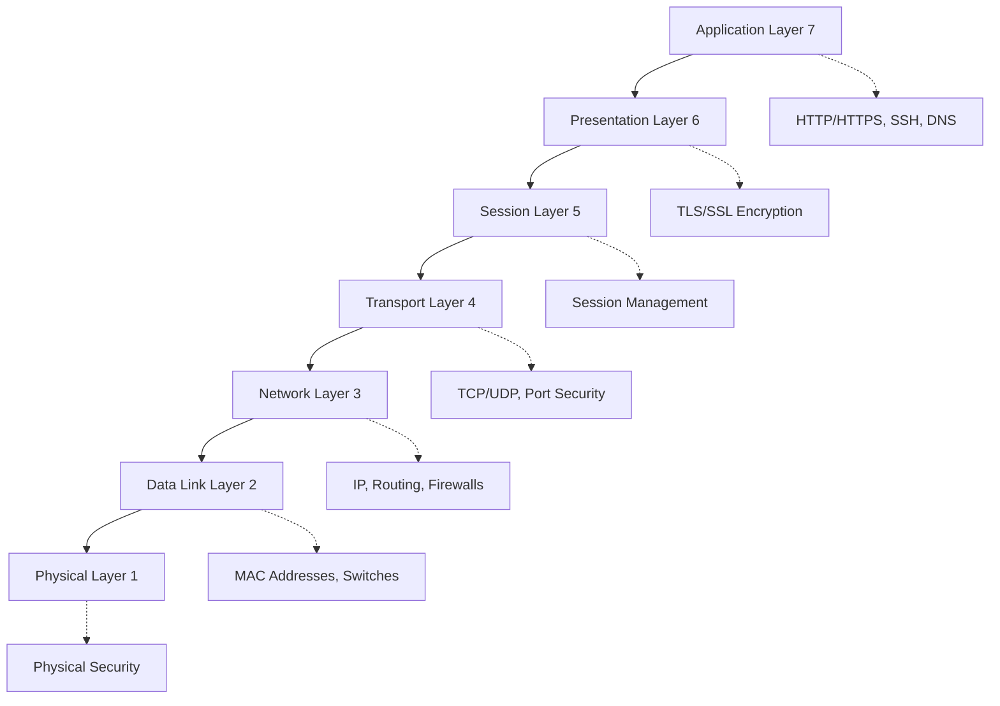
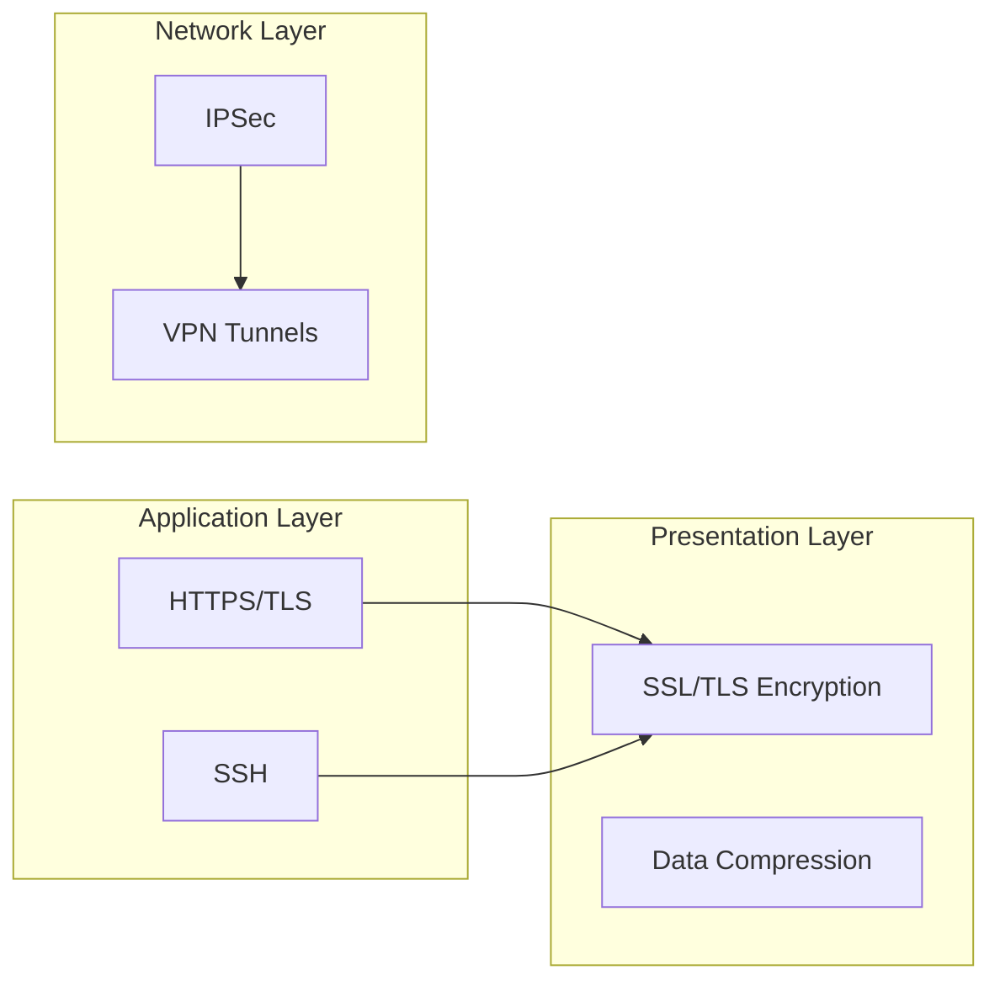
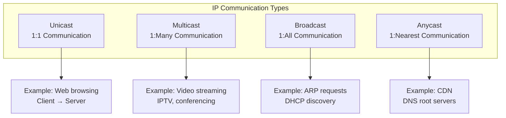
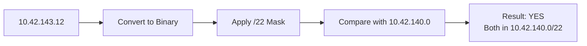
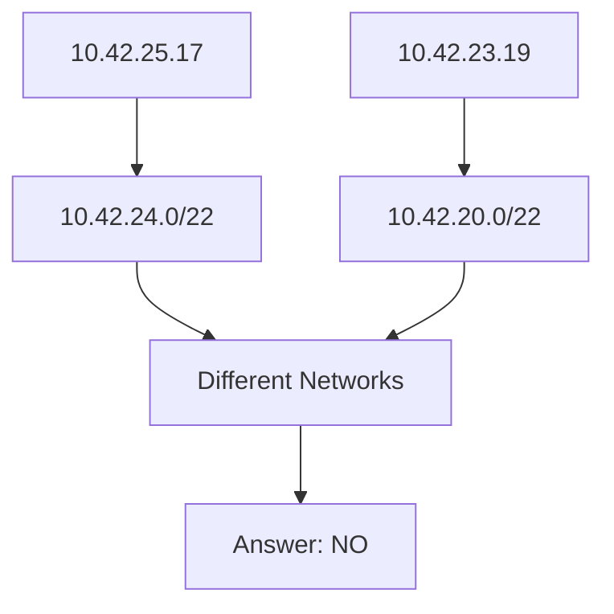
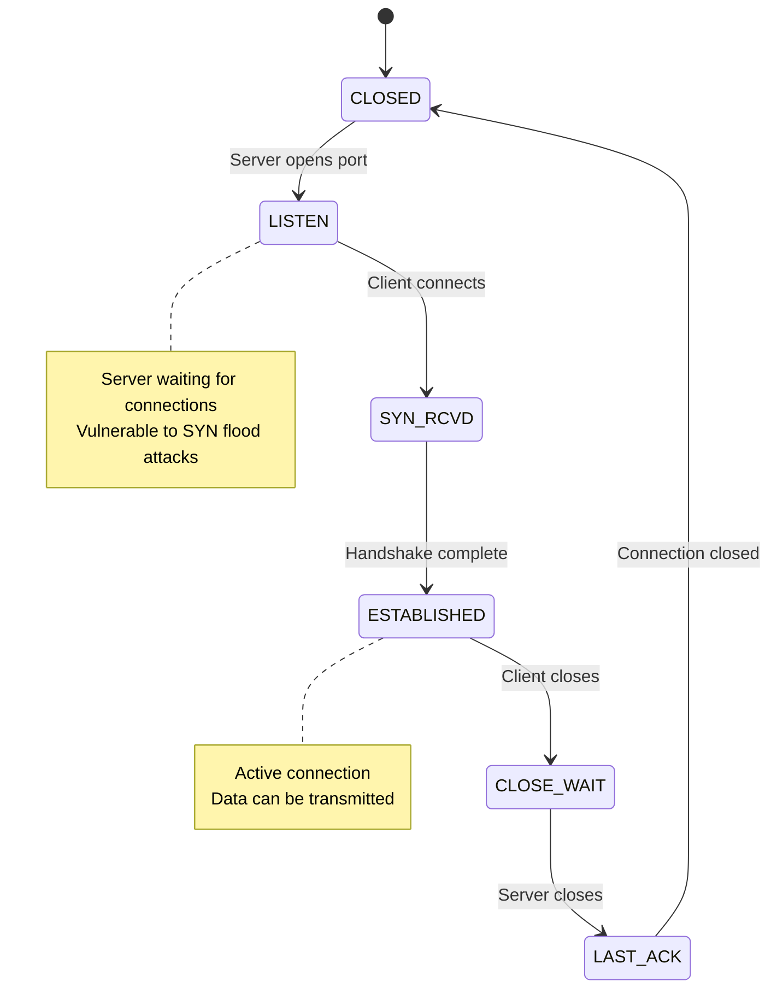
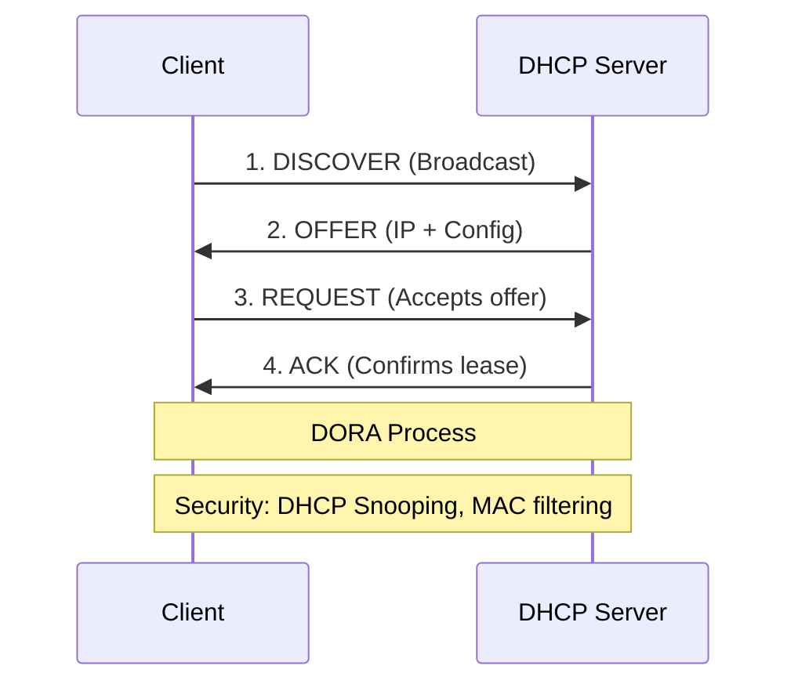
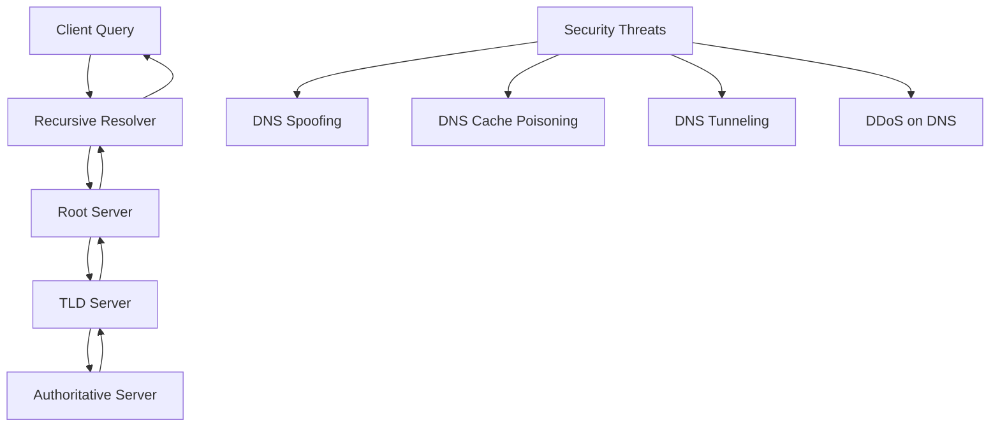
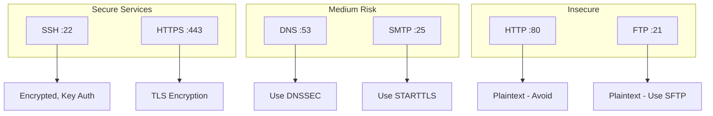
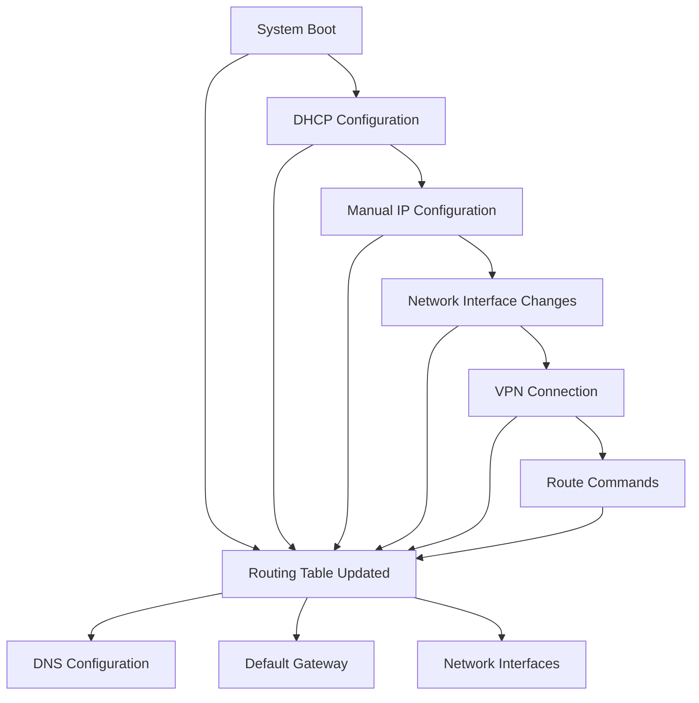

# Network Fundamentals & Security

## OSI Model (7 Layers)

The OSI model is fundamental to understanding network security. Each layer has specific security considerations:

### Security at Each Layer

| Layer | Security Focus | Examples |
|-------|----------------|----------|
| **Layer 7 (Application)** | Application security, input validation | HTTPS, SSH authentication |
| **Layer 6 (Presentation)** | **Encryption/Decryption** | TLS/SSL encryption |
| **Layer 5 (Session)** | Session management, authentication | Session tokens, Kerberos |
| **Layer 4 (Transport)** | **Port security, secure protocols** | TCP/UDP security, firewalls |
| **Layer 3 (Network)** | IP security, routing security | IPSec, network firewalls |
| **Layer 2 (Data Link)** | Switch security, MAC filtering | 802.1X, VLAN security |
| **Layer 1 (Physical)** | Physical access control | Cable security, facility access |

### Where Encryption Occurs

## IP Communication Types

Understanding different IP communication methods is crucial for network security:

### Security Implications

- **Unicast**: Standard communication, easier to secure
- **Multicast**: Can be exploited for DDoS amplification
- **Broadcast**: Security risk in switching networks
- **Anycast**: Used by CDNs, helps with DDoS mitigation

## Network Addressing & Subnetting

### Example: Network Calculation

**Question**: Is 10.42.143.12 in network 10.42.140.0/22?

**Calculation**:
- /22 = 255.255.252.0
- 10.42.143.12 & 255.255.252.0 = 10.42.140.0
- Match! ✓

### Another Example: Network Comparison

**Question**: Are 10.42.25.17 and 10.42.23.19 in the same network with netmask 255.255.252.0?

## TCP States & Security

### Security Considerations

- **LISTEN**: Server is waiting for connections - vulnerable to SYN flood attacks
- **ESTABLISHED**: Active connection - data transmission possible, requires monitoring

## DHCP Process

### Security Implications

- **DHCP Spoofing**: Rogue DHCP servers can redirect traffic
- **DHCP Starvation**: Exhaust IP pool with fake requests
- **Protection**: DHCP snooping, port security, MAC filtering

## DNS Security

### DNS Security Measures

- **DNSSEC**: Cryptographic signatures for DNS responses
- **DNS over HTTPS (DoH)**: Encrypted DNS queries
- **DNS Filtering**: Block malicious domains

## Port Security

### Important Ports & Their Security Assessment

| Port | Service | Protocol | Security Assessment |
|------|---------|----------|-------------------|
| **22** | SSH | TCP | ✅ **Secure** - Encrypted, key-based auth |
| **25** | SMTP | TCP | ⚠️ **Medium** - Can be encrypted (STARTTLS) |
| **53** | DNS | UDP/TCP | ⚠️ **Medium** - Use DNSSEC, filter queries |
| **80** | HTTP | TCP | ❌ **Insecure** - Plaintext, use HTTPS |
| **443** | HTTPS | TCP | ✅ **Secure** - TLS encrypted |

## Routing Security

### When Routing Tables Change

### Security Considerations

- **Route Hijacking**: Malicious route advertisements
- **BGP Security**: Route filtering, authentication
- **VPN Security**: Encrypted tunnels for remote access

## Test Preparation Summary

### Key Security Concepts to Remember

1. **Layered Security**: Each OSI layer has specific security measures
2. **Encryption Placement**: Primarily at Presentation (TLS/SSL) and Network (IPSec) layers
3. **Network Segmentation**: Proper subnetting improves security
4. **Protocol Security**: Choose secure protocols (SSH vs Telnet, HTTPS vs HTTP)
5. **Monitoring**: Track connection states and network traffic
