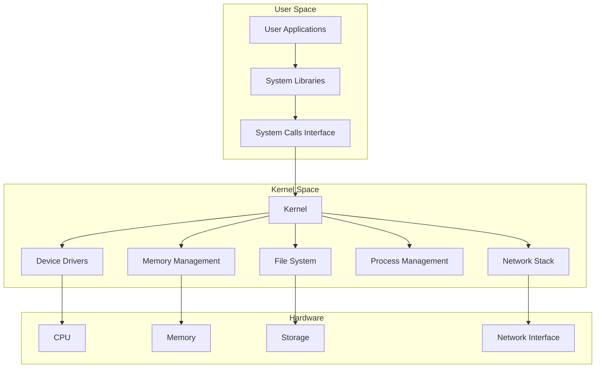
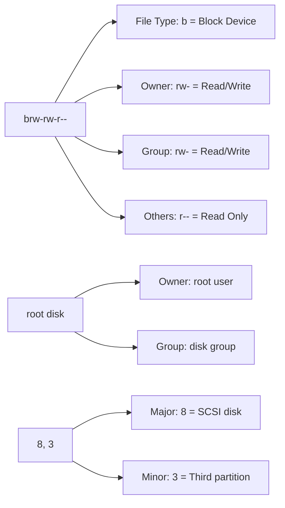
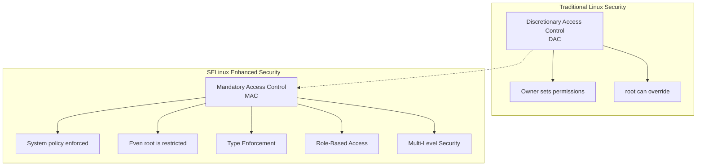
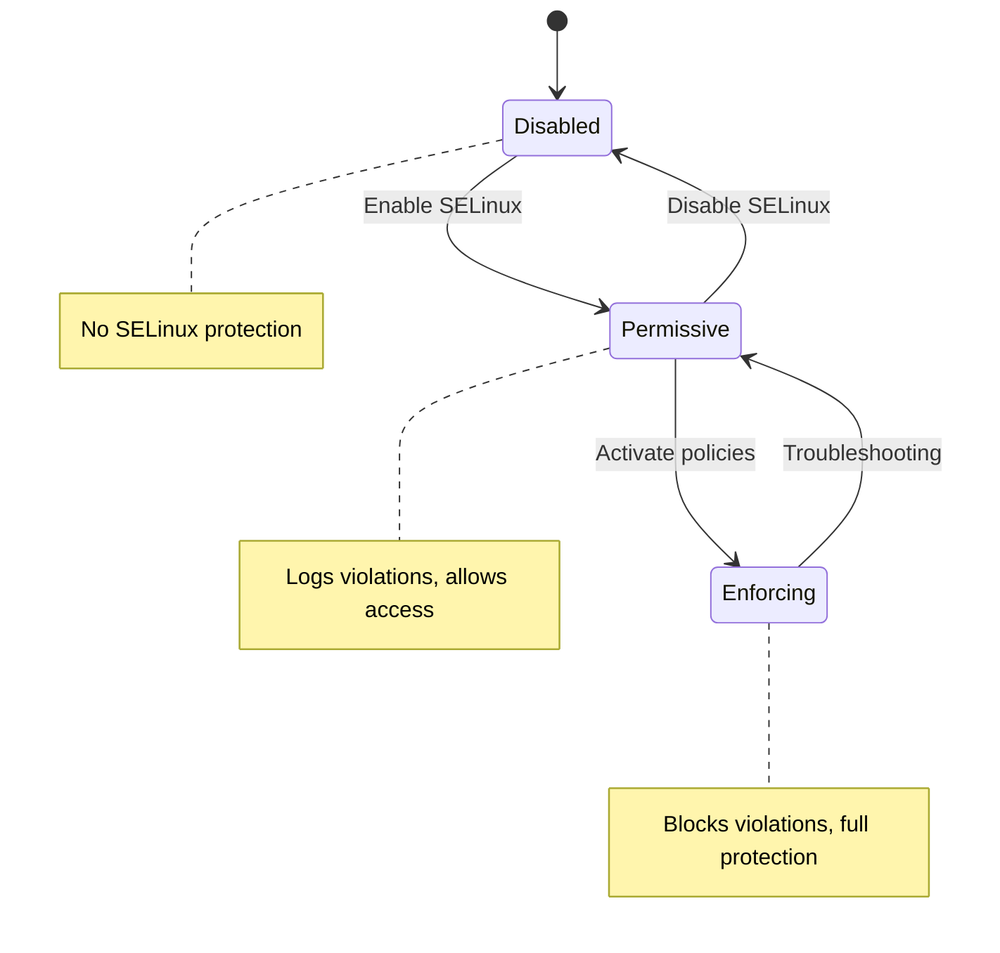
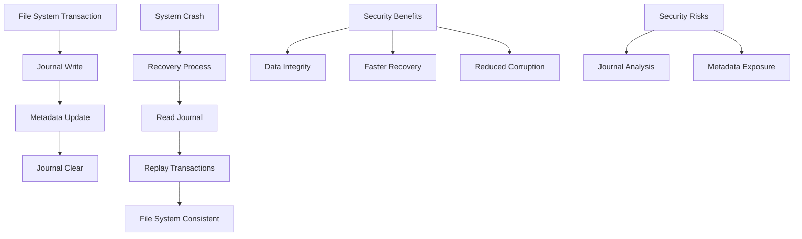
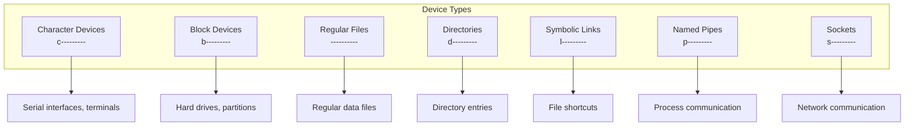
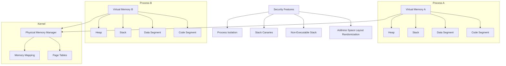
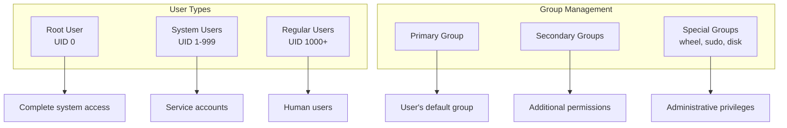
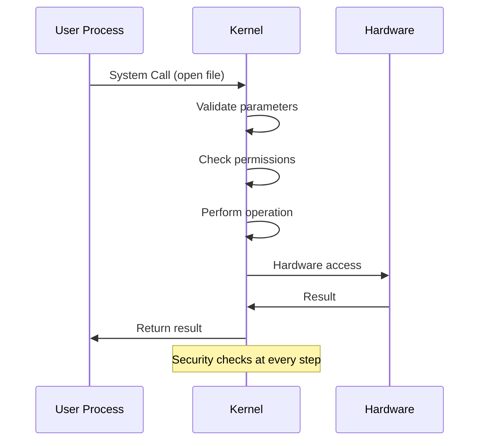

# Operating System Security

## UNIX/Linux Architecture Security Model

Understanding the layered security model of UNIX/Linux systems is crucial for system security:



### Security at Each Layer

| Layer | Security Mechanisms | Examples |
|-------|-------------------|----------|
| **User Applications** | Input validation, secure coding | Web browsers, text editors |
| **System Libraries** | Buffer overflow protection, ASLR | libc, OpenSSL |
| **System Calls** | Permission checks, parameter validation | open(), read(), write() |
| **Kernel** | Process isolation, memory protection | Kernel modules, system calls |
| **Device Drivers** | Hardware abstraction, access control | Network drivers, storage drivers |
| **Hardware** | Hardware-based security features | CPU rings, MMU, TPM |

## File System Security

### File Permissions Example

```bash
# ls -l /dev/sda3
brw-rw-r--. 1 root disk 8, 3 Jun 11  8:57 /dev/sda3
```

Let's break down this listing:



### Security Implications

- **Block device** with read/write access for root and disk group
- **Potential risk**: Members of disk group can read raw disk data
- **Mitigation**: Limit disk group membership, use device encryption

## SELinux Security

SELinux (Security-Enhanced Linux) provides mandatory access control:



### SELinux Security Benefits

1. **Principle of Least Privilege**: Processes run with minimal required permissions
2. **Containment**: Compromised processes are limited in damage scope
3. **Policy-Based**: Security policies define allowed interactions
4. **Audit Trail**: All access attempts are logged

### SELinux Modes



## File System Security Features

### Journaling File Systems (ext4)



### Is Journaling Good for Security?

**✅ Positive Aspects:**
- **Data Integrity**: Reduces corruption from unexpected shutdowns
- **Fast Recovery**: System boots faster after crashes
- **Consistency**: File system structure remains intact

**⚠️ Potential Risks:**
- **Forensic Analysis**: Journal may contain sensitive metadata
- **Performance**: Slight overhead from journaling operations

**Overall Assessment**: **Good for security** - integrity benefits outweigh risks

## Device Security

### Device Types and Security



### Device Security Best Practices

1. **Restrict Device Access**: Limit who can access device files
2. **Use Groups Properly**: Don't add users to powerful groups unnecessarily
3. **Monitor Device Access**: Log access to sensitive devices
4. **Encrypt Block Devices**: Use dm-crypt/LUKS for disk encryption

## Memory Protection

### Virtual Memory Security



### Memory Protection Mechanisms

- **ASLR (Address Space Layout Randomization)**: Randomizes memory layout
- **DEP (Data Execution Prevention)**: Prevents code execution in data segments
- **Stack Canaries**: Detect stack buffer overflows
- **Process Isolation**: Each process has separate memory space

## User and Group Security

### User Account Security Model



### Security Best Practices

1. **Principle of Least Privilege**: Grant minimum required permissions
2. **Regular Audits**: Review user accounts and group memberships
3. **Strong Authentication**: Use strong passwords, multi-factor authentication
4. **Account Monitoring**: Log and monitor user activities

## System Call Security

### System Call Interface



### Security Checks in System Calls

1. **Parameter Validation**: Check for buffer overflows, invalid pointers
2. **Permission Checks**: Verify user has required access rights
3. **Resource Limits**: Enforce quotas and limits
4. **Audit Logging**: Record security-relevant events

## Test Preparation: Key Points

### Operating System Security Checklist

- [ ] Understand UNIX layered architecture
- [ ] Know file permission interpretation
- [ ] Understand SELinux benefits and modes
- [ ] Recognize device security implications
- [ ] Know memory protection mechanisms
- [ ] Understand user/group security model
- [ ] Recognize system call security checks

### Common Security Issues

1. **Privilege Escalation**: Gaining higher privileges than intended
2. **Buffer Overflows**: Memory corruption attacks
3. **Race Conditions**: Timing-based security vulnerabilities
4. **Information Disclosure**: Unintended data exposure
5. **Denial of Service**: Resource exhaustion attacks
