# Web Security & LAMP Stack

## Information Security Triad (CIA)

The three fundamental security goals that every system must address:

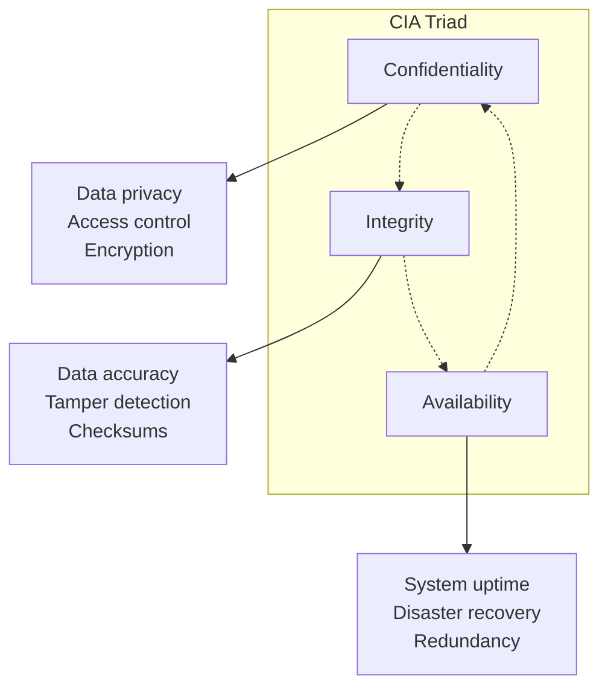

### Practical Example: Online Banking

| CIA Aspect | Banking Application | Security Measures |
|------------|-------------------|-------------------|
| **Confidentiality** | Account numbers, balances must be private | HTTPS encryption, access controls |
| **Integrity** | Transaction amounts must be accurate | Digital signatures, checksums |
| **Availability** | System must be accessible 24/7 | Load balancing, redundancy |

## LAMP Stack Architecture

LAMP (Linux, Apache, MySQL, PHP) is a popular web development stack:

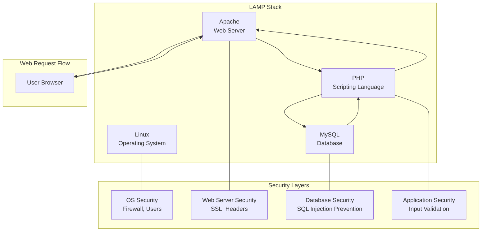

### LAMP Security Considerations

**Why LAMP is needed:**
- Dynamic web applications
- Database-driven content
- Server-side processing
- User authentication systems

**Security challenges:**
- Multiple attack vectors
- Complex interactions between components
- Regular security updates required

## HTTP vs HTTPS Security

### HTTP (Insecure)

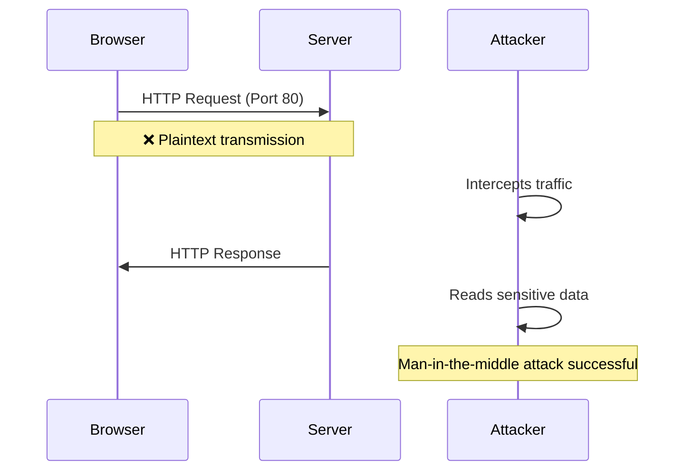

### HTTPS (Secure)

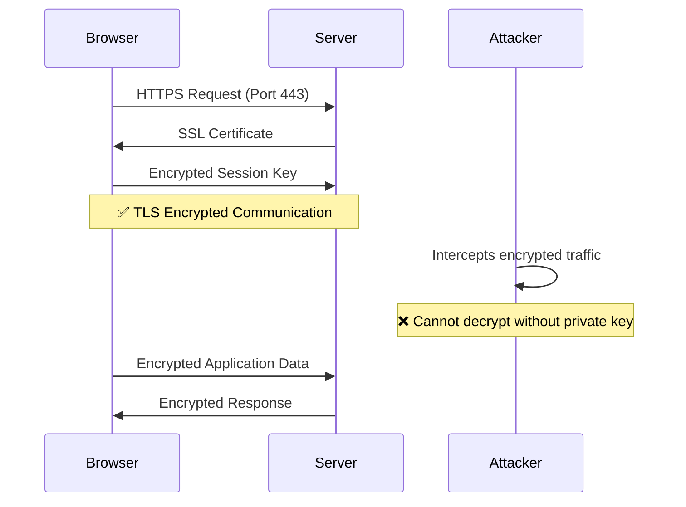

### Security Comparison

| Aspect | HTTP | HTTPS |
|--------|------|--------|
| **Encryption** | ❌ None | ✅ TLS/SSL |
| **Data Integrity** | ❌ No protection | ✅ Checksum verification |
| **Authentication** | ❌ No server verification | ✅ Certificate validation |
| **Port** | 80 | 443 |
| **Performance** | Faster | Slight overhead |

## SSH vs HTTPS Security Comparison

### SSH (Secure Shell)

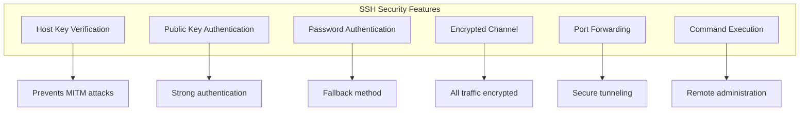

### HTTPS vs SSH Security Analysis

| Security Aspect | SSH | HTTPS |
|-----------------|-----|--------|
| **Confidentiality** | ✅ Full encryption | ✅ Full encryption |
| **Integrity** | ✅ MAC verification | ✅ TLS integrity |
| **Authentication** | ✅ Host + User auth | ✅ Server auth only |
| **Use Case** | Remote shell access | Web communication |
| **Key Exchange** | Diffie-Hellman | TLS key exchange |
| **Port** | 22 | 443 |

### CIA Implementation

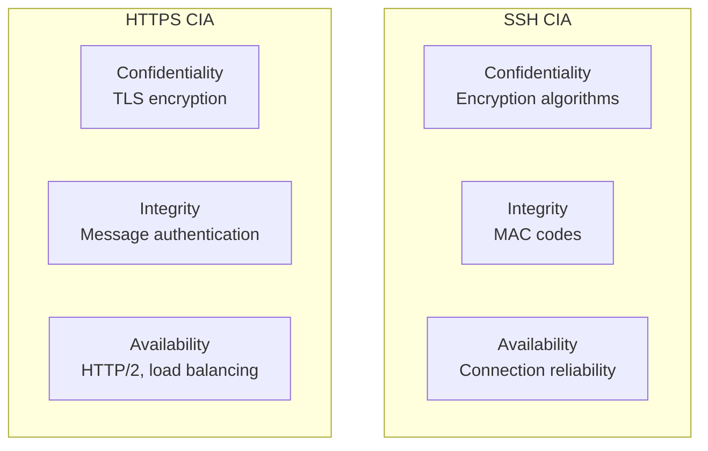

## Web Application Vulnerabilities

### SQL Injection

SQL Injection occurs when user input is directly inserted into SQL queries:

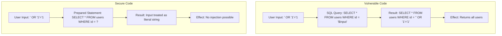

### Prevention Methods

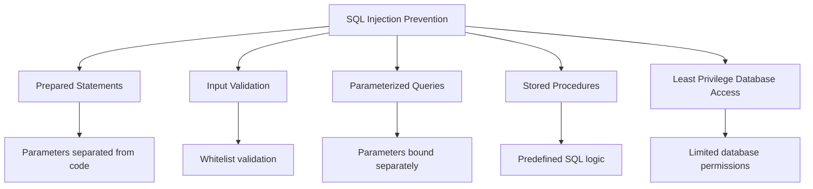

### Cross-Site Scripting (XSS)

XSS allows attackers to inject malicious scripts into web pages:

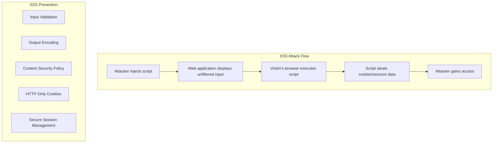

### XSS vs SQL Injection Comparison

| Aspect | SQL Injection | Cross-Site Scripting |
|--------|---------------|---------------------|
| **Target** | Database | Web browser |
| **Impact** | Data theft, modification | Session hijacking, defacement |
| **Prevention** | Prepared statements | Input validation, output encoding |
| **Scope** | Server-side | Client-side |
| **Detection** | Database logs | Web application logs |

## CMS Security Issues

### Why CMS Sites Are More Vulnerable

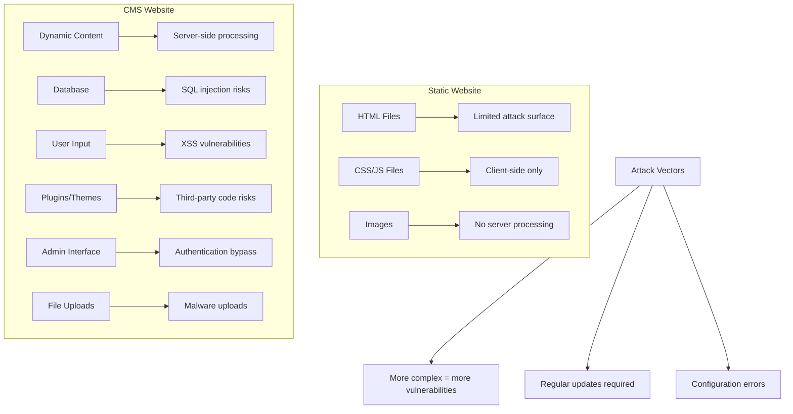

### CMS Security Characteristics

**What makes a standard CMS:**
1. **Dynamic Content Generation**: Server-side processing
2. **Database Integration**: Content stored in database
3. **User Management**: Authentication and authorization
4. **Plugin/Theme System**: Extensible architecture
5. **Admin Interface**: Web-based management

**Why it facilitates attacks:**
- **Larger Attack Surface**: More code means more vulnerabilities
- **Third-party Dependencies**: Plugins and themes may have security flaws
- **Configuration Complexity**: Many settings can be misconfigured
- **Update Lag**: Sites often run outdated versions

## PHP vs JavaScript Security

### Server-Side Security Comparison

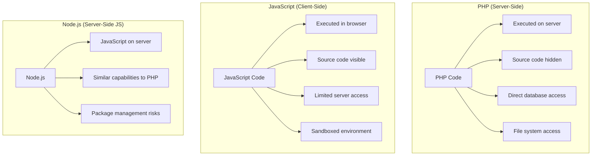

### Security Analysis: PHP vs JavaScript

**JavaScript is generally more secure for the following reasons:**

1. **Sandboxing**: Browsers sandbox JavaScript execution
2. **No Direct File Access**: Cannot access local file system
3. **Same-Origin Policy**: Restricts cross-domain requests
4. **Limited Server Access**: Cannot directly access server resources

**Why we still need PHP (or server-side languages):**
- **Database Operations**: Secure server-side database access
- **Authentication**: Server-side session management
- **File Operations**: Server file system access
- **Business Logic**: Sensitive operations hidden from client

### Best Practices

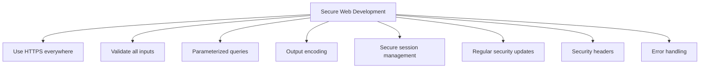

## Virtual Machine vs Physical Server Security

### Architecture Comparison

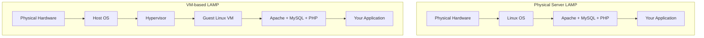

### Security Pros and Cons

| Aspect | Physical Server | Virtual Machine |
|--------|-----------------|-----------------|
| **Isolation** | ❌ Single point of failure | ✅ Better isolation |
| **Resource Control** | ✅ Full hardware access | ⚠️ Shared resources |
| **Attack Surface** | ✅ Smaller | ❌ Larger (hypervisor) |
| **Backup/Recovery** | ❌ Complex | ✅ Snapshot-based |
| **Scalability** | ❌ Limited | ✅ Easy scaling |
| **Cost** | ❌ Higher | ✅ Lower |
| **Performance** | ✅ Native performance | ⚠️ Slight overhead |
| **Security Updates** | ✅ Direct control | ❌ Multiple layers |

### CIA Analysis: Physical vs VM

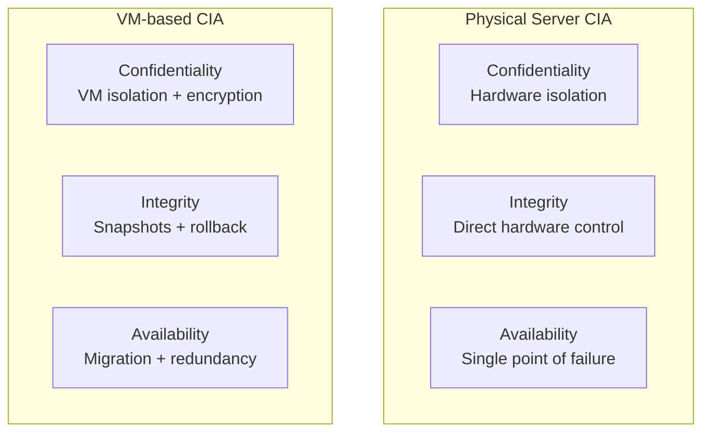

## Test Preparation Summary

### Key Web Security Concepts

1. **CIA Triad**: Confidentiality, Integrity, Availability
2. **LAMP Stack**: Linux, Apache, MySQL, PHP architecture
3. **HTTP vs HTTPS**: Encryption and security differences
4. **Web Vulnerabilities**: SQL injection, XSS prevention
5. **CMS Security**: Why dynamic sites are more vulnerable
6. **Language Security**: PHP vs JavaScript security implications
7. **Infrastructure**: Physical vs virtual server security trade-offs

### Critical Security Measures

- Always use HTTPS for web applications
- Implement proper input validation and output encoding
- Use prepared statements for database queries
- Keep all software components updated
- Implement proper authentication and session management
- Use security headers and CSP
- Regular security audits and penetration testing
