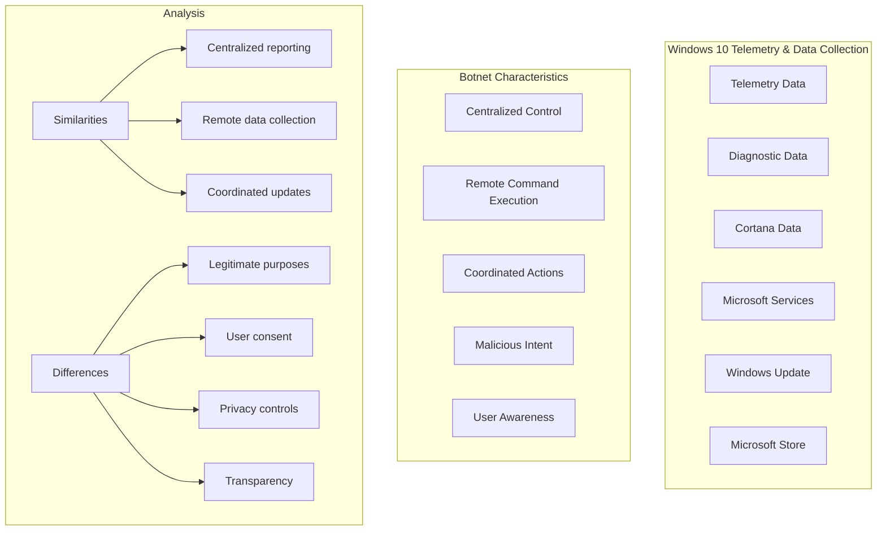
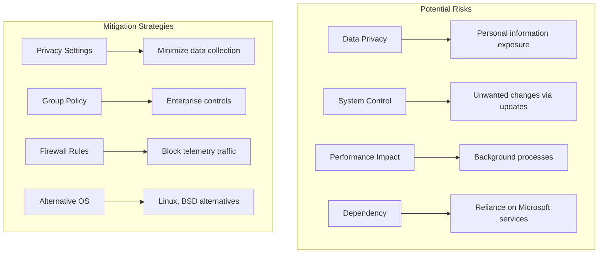
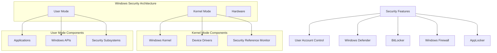
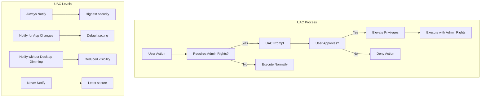
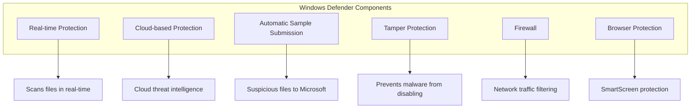
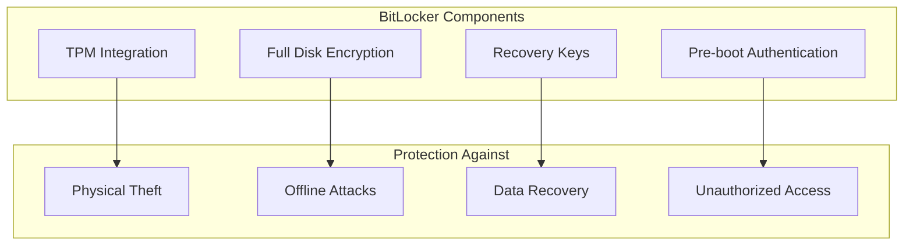
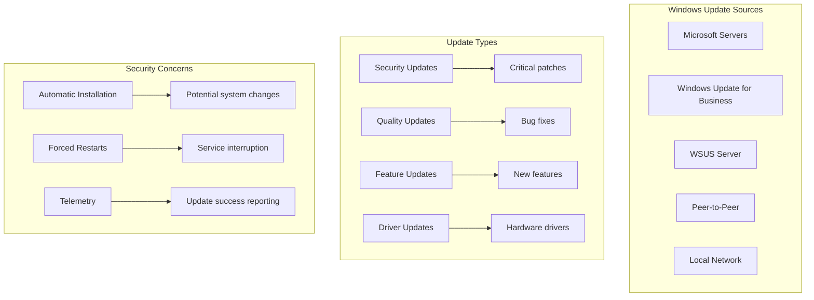
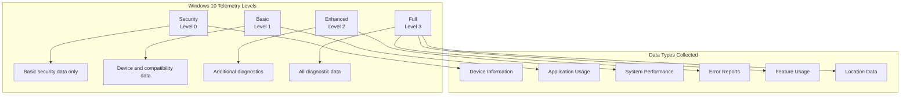
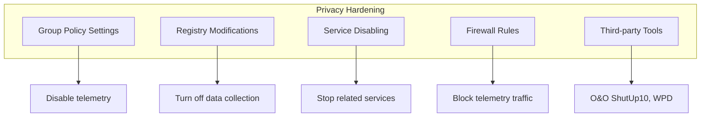
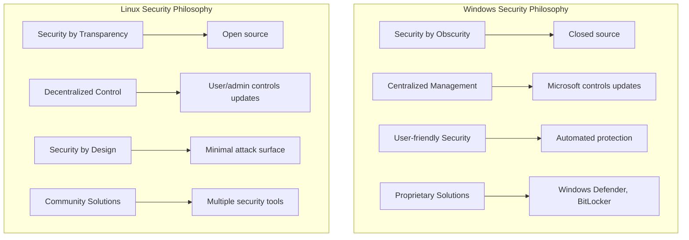

# Microsoft Windows Security Analysis

## Windows 10 Botnet Discussion

### The Controversial Question

*"Bilden alle mit dem Internet verbundenen Windows-10-Rechner (mit abgestellten automatischen Updates, soweit möglich!) ein von Microsoft kontrolliertes Botnet?"*

Let's analyze this critically:

### Arguments FOR the "Botnet" Perspective

**Technical Similarities:**
- **Centralized Control**: Microsoft can push updates and configurations
- **Remote Data Collection**: Extensive telemetry sent to Microsoft servers
- **Coordinated Actions**: All Windows 10 machines can receive simultaneous updates
- **Limited User Control**: Some telemetry cannot be completely disabled

**Privacy Concerns:**
- **Data Collection**: Usage patterns, app data, location information
- **Forced Updates**: Automatic updates that can't be fully disabled
- **Background Processes**: Continuous communication with Microsoft servers

### Arguments AGAINST the "Botnet" Perspective

**Legitimate Purposes:**
- **Security Updates**: Critical patches for vulnerabilities
- **Improvement**: Product development and bug fixes
- **User Experience**: Personalization and feature enhancement
- **Support**: Diagnostics and troubleshooting

**User Consent & Control:**
- **Privacy Settings**: Users can adjust telemetry levels
- **Transparency**: Microsoft publishes what data is collected
- **Legal Framework**: Governed by privacy laws and regulations
- **Opt-out Options**: Many features can be disabled

### Security Assessment

### Conclusion

**It's NOT a traditional botnet because:**
1. **Legitimate Purpose**: Security and functionality improvements
2. **User Consent**: Users agree to terms of service
3. **Legal Framework**: Regulated by privacy laws
4. **Transparency**: Microsoft documents data collection practices

**However, it shares concerning similarities:**
1. **Centralized Control**: Microsoft has significant control over systems
2. **Mass Coordination**: Ability to push changes to millions of machines
3. **Limited User Control**: Some telemetry cannot be completely disabled
4. **Data Collection**: Extensive information gathering

**Better Description**: "Centralized Management Platform" rather than "Botnet"

## Windows Security Architecture

### Windows Security Model

### Windows vs Linux Security Comparison

| Aspect | Windows 10 | Linux |
|--------|------------|-------|
| **Open Source** | ❌ Closed source | ✅ Open source |
| **Update Control** | ❌ Limited control | ✅ Full control |
| **Telemetry** | ❌ Extensive | ✅ Minimal/optional |
| **Privacy** | ❌ Data collection | ✅ User controlled |
| **Customization** | ❌ Limited | ✅ Full customization |
| **Security Updates** | ✅ Automatic | ⚠️ Manual management |
| **User Experience** | ✅ User-friendly | ⚠️ Learning curve |
| **Hardware Support** | ✅ Excellent | ⚠️ Variable |

## Windows Security Features

### User Account Control (UAC)

### Windows Defender

### BitLocker Drive Encryption

## Windows Update Security

### Update Delivery Optimization

### Update Security Benefits vs Risks

**Benefits:**
- **Security Patches**: Fixes for known vulnerabilities
- **Malware Protection**: Enhanced security features
- **Stability**: Bug fixes and improvements
- **Feature Updates**: New security capabilities

**Risks:**
- **System Changes**: Unwanted modifications
- **Compatibility Issues**: Broken software/drivers
- **Performance Impact**: Resource consumption
- **Privacy Concerns**: Telemetry data collection

## Windows Privacy Controls

### Telemetry Levels

### Privacy Hardening Options

## Windows vs Linux Security Philosophy

### Security Approaches

### Trade-offs Analysis

| Aspect | Windows Approach | Linux Approach |
|--------|------------------|----------------|
| **Security Model** | Trust in Microsoft | Trust in community |
| **Update Control** | Automatic, limited choice | Full user control |
| **Transparency** | Limited visibility | Full source code access |
| **Customization** | Restricted | Complete freedom |
| **User Experience** | Streamlined | Requires expertise |
| **Enterprise Support** | Comprehensive | Community + commercial |

## Conclusion: The "Botnet" Question

### Final Assessment

The Windows 10 "botnet" characterization is **provocative but not entirely accurate**:

**More Accurate Descriptions:**
- **Centralized Management Platform**: Microsoft can manage systems remotely
- **Telemetry Network**: Extensive data collection for product improvement
- **Managed Computing Environment**: User agency balanced with automated management

**Key Differentiators from Botnets:**
- **Legal Framework**: Governed by privacy laws and user agreements
- **Legitimate Purpose**: Security, functionality, and user experience
- **User Consent**: Users agree to terms (though with limited alternatives)
- **Transparency**: Microsoft documents data collection practices

**Valid Concerns:**
- **Data Privacy**: Extensive information collection
- **System Autonomy**: Limited user control over system behavior
- **Vendor Lock-in**: Difficulty in avoiding Microsoft's ecosystem
- **Mass Coordination**: Ability to push changes to millions of systems

### Recommendations

1. **For Privacy-Conscious Users**: Consider Linux alternatives or aggressive Windows hardening
2. **For Enterprises**: Implement Group Policy controls and WSUS for update management
3. **For General Users**: Understand and configure privacy settings appropriately
4. **For Security**: Keep systems updated while being aware of privacy implications

The discussion highlights important questions about digital autonomy, privacy, and the balance between security and user control in modern computing environments.
