## 1. Identify our VM

we can identify our VM by searching for our SSH Public Key which we had stored earlier.
We stored the raw content of the .pub file before. What we have in the `ssh-keys-final.txt`file is the fingerprint and not the raw public key. We need to hash it before we can compare them.

To do that, we can relay our key with echo and then pipe it trough the ssh-keygen like this
```sh
echo "<key_content>" | ssh-keygen -lf -
```
where the flags `-l`means list fingerprint and `-f`sets the file to read. As "File to read" we set `-`which is actually not a file but the stdin. This of course is the key_content we relayed with echo before.
![[Pasted image 20250620084028.png]]
This fingerprint we can find in our list and our VM is `studi36-labor42.f2.htw-berlin.de` so we can logg it to it with

```sh
ssh root@studi36-labor42.f2.htw-berlin.de
```

Since I connected from my linux system to the VM before we have to enable the SSH authentication with the SSH key. I did not turn off login with password, therefore we can just log in and do the command again

```sh
ssh-copy-id root@studi36-labor42.f2.htw-berlin.de
```
![[Pasted image 20250620095735.png]]
## 2. Set the correct FQDN

We are studi36 so our hostname should be  `studi36-labor42.f2.htw-berlin.de`
### Understanding the hostname

The hostname is defined in `/etc/hostname`
currently our hostname is already working correctly as expected, but the assignment says we should set it manually.
The transient hostname was likely set by the DHCP server
![[Pasted image 20250620100936.png]]
there is a Static one with .detest, lets just not have the .detest here it is not correct
```sh
hostnamectl set-hostname studi36-labor42.f2.htw-berlin.de
```
![[Pasted image 20250620101142.png]]The static hostname is now correct.

## 3. Reduce Autostart programs

We can list the programs that are running at the moment with 
```sh
ps auxfw
```

![[Pasted image 20250620101638.png]]
We can list all system deamons with `systemctl`
![[Pasted image 20250620101959.png]]
Quit it with `q`

better yet we can show the enabled ones only with
```sh
systemctl list-unit-files --type=service --state=enabled
```

![[Pasted image 20250705202517.png]]

### What services can we deactivate?

I asked the Chat GPT to explain all the services to me so I have a better understanding of the System.

| **Service**                        | **Description**                             | **Recommendation** | **Reason**                                                            |
| ---------------------------------- | ------------------------------------------- | ------------------ | --------------------------------------------------------------------- |
| atd.service                        | Schedules one-time delayed jobs (via at)    | Optional           | Only needed if you use the at command                                 |
| auditd.service                     | Security audit daemon                       | **Keep**           | Required for system auditing/compliance                               |
| bluetooth.service                  | Manages Bluetooth devices                   | **Disable**        | Not needed on servers without Bluetooth                               |
| chronyd.service                    | Network time synchronization                | Optional           | Disable only if another NTP mechanism is used                         |
| crond.service                      | Schedules recurring tasks (cron)            | **Keep**           | Needed for routine jobs like backups, log rotation                    |
| dbus-broker.service                | Core IPC system for D-Bus                   | **Keep**           | Required by many system services                                      |
| firewalld.service                  | Dynamic firewall daemon                     | Optional           | Disable only if using external firewall or nftables/iptables directly |
| getty@.service                     | Manages console logins (TTYs)               | **Keep**           | Required for login access on physical terminals                       |
| irqbalance.service                 | Distributes hardware interrupts across CPUs | Optional           | Helps performance on multi-core machines                              |
| iscsi-onboot.service               | Starts iSCSI targets at boot                | Optional           | Needed only if using iSCSI disks                                      |
| iscsi-starter.service              | iSCSI initiator                             | Optional           | Same as above                                                         |
| kdump.service                      | Kernel crash dump tool                      | Optional           | Disable if you don’t need crash diagnostics                           |
| libstoragemgmt.service             | Manages SAN/storage arrays                  | Optional           | Disable unless managing enterprise storage                            |
| low-memory-monitor.service         | Monitors and reacts to low memory           | **Disable**        | GNOME/desktop related – not useful on servers                         |
| lvm2-monitor.service               | Monitors LVM volumes                        | **Keep**           | Required if you use LVM                                               |
| mcelog.service                     | Logs hardware (CPU/RAM) errors              | Optional           | Good for diagnostics but not essential                                |
| mdmonitor.service                  | Monitors software RAID (mdadm)              | Optional           | Needed only if you use software RAID                                  |
| microcode.service                  | Installs CPU microcode updates              | **Keep**           | Improves CPU security and stability                                   |
| multipathd.service                 | Handles multipath I/O (SANs)                | Optional           | Needed only for SAN/multipath setups                                  |
| NetworkManager-dispatcher.service  | Runs scripts on network changes             | Optional           | Only needed if using NM hook scripts                                  |
| NetworkManager-wait-online.service | Waits for network before boot continues     | Optional           | Disable unless needed for boot dependencies                           |
| NetworkManager.service             | Main network manager                        | **Keep**           | Core network service unless replaced by network.service               |
| nis-domainname.service             | Sets domain name for NIS                    | **Disable**        | Legacy network system; unused in most setups                          |
| nvmefc-boot-connections.service    | NVMe over Fibre Channel boot service        | Optional           | Needed only if booting from NVMe over FC                              |
| qemu-guest-agent.service           | Communicates with host hypervisor           | **Keep**           | Useful inside VMs (QEMU/KVM)                                          |
| rpcbind.service                    | RPC service needed for NFSv3                | Optional           | Only needed for legacy NFS or RPC services                            |
| rsyslog.service                    | Syslog daemon for logging                   | **Keep**           | Manages logs; critical unless using journald-only setup               |
| rtkit-daemon.service               | Realtime permissions (used by PulseAudio)   | **Disable**        | Desktop/audio related, not needed on servers                          |
| selinux-autorelabel-mark.service   | Handles SELinux relabeling                  | **Keep**           | Needed for SELinux to function properly                               |
| smartd.service                     | Monitors hard disk health (SMART)           | Optional           | Good for monitoring, but can be disabled                              |
| sshd.service                       | OpenSSH daemon                              | **Keep**           | Critical for remote access                                            |
| sssd.service                       | Manages NSS/LDAP/Kerberos/AD auth           | **Keep**           | Required for domain or centralized user auth                          |
| systemd-boot-update.service        | Updates systemd-boot on kernel changes      | **Keep**           | Only needed if using systemd-boot                                     |
| systemd-network-generator.service  | Generates network configs dynamically       | **Keep**           | Required in some setups with NM/systemd-netd                          |
| tuned.service                      | Dynamic performance tuning daemon           | Optional           | Disable if you don’t need system tuning profiles                      |
| udisks2.service                    | Disk hotplug & desktop storage daemon       | **Disable**        | Desktop-only; not needed on headless servers                          |
| upower.service                     | Power management daemon                     | **Disable**        | Also desktop-related; not relevant on servers                         |
There are to many services which would take to much time researching them, so I just clone my local VM instance and try disabling all the ones it recommended to disable, then the optionals and if I then still can log in I will deactivate them all in the server

#### Command to disable services

These are for sure not needed
```sh
systemctl disable nis-domainname.service iscsi-onboot.service libstoragemgmt.service mcelog.service mdmonitor.service microcode.service
```

Back on my Linux system where my local VM is, disabling the ones not needed for testing
![[Pasted image 20250705205543.png]]
Yes I can still log in after reboot.
![[Pasted image 20250705205659.png]]


And these are the optional ones, since the first worked I can try these. Since I am on a copy of the local VM even I can try here as much as I want.

```sh
systemctl disable bluetooth.service irqbalance.service upower.service smartd.service low-memory-monitor.service
```

![[Pasted image 20250705205949.png]]
these are also fine to disable I could still log in

The following ones need testing before disabling, so I check the conditions of those one by one on my local VM

| **Service**                   | **Disable Command**                    | **Purpose**                                       | **How to Test If Needed**                                                                       | My Test Result                                                                                                           | Disable? |
| ----------------------------- | -------------------------------------- | ------------------------------------------------- | ----------------------------------------------------------------------------------------------- | ------------------------------------------------------------------------------------------------------------------------ | -------- |
| tuned.service                 | systemctl disable tuned.service        | Power/cpu tuning profiles (performance/powersave) | Run tuned-adm active. If not actively tuning, safe to disable.                                  | tuned-adm active<br>Current active profile: virtual-guest<br>--> Profile for running in a VM, which we are so we keep it | No       |
| firewalld.service             | systemctl disable firewalld.service    | Firewall management                               | Only safe to disable if the VM is in a trusted network (e.g. local LAN or isolated lab).        | No we are not                                                                                                            | No       |
| sssd.service                  | systemctl disable sssd.service         | Domain account support (LDAP, AD)                 | If you’re not using enterprise login systems, this is safe. Try logging in without it.          | Could login after disabling                                                                                              | Yes      |
| rsyslog.service               | systemctl disable rsyslog.service      | Legacy syslog logging                             | If you use journald only (journalctl), this may be redundant. Check `ps aux                     | Disabled it, rebooted and checked `journalctl -b` if logging is still done with jounalctl                                | Yes      |
| rtkit-daemon.service          | systemctl disable rtkit-daemon.service | Real-time audio support                           | If you’re not using PulseAudio/pipewire, not needed. Try audio apps if unsure.                  | I do not use audio anyways                                                                                               | Yes      |
| getty@tty1.service (template) | systemctl disable getty@tty1.service   | Console login prompt                              | If using SSH only, can disable to free a TTY. But keep at least one getty if debugging locally. | I want to keep it otherwise I would loose the option of remote hands if I make a mistake                                 | No       |

Lets test it on our VM, these are the ones we decided to also disable:
```sh
systemctl disable sssd.service rsyslog.service rtkit-daemon.service
```
![[Pasted image 20250705213036.png]]
Yes we can still log in on the local VM. Lets repeat all on the server.

Lets first measure the impact on the server we have by disabling them. We run the following commands before and after
```sh
systemd-analyze blame
```
actually this gives me to much information, we want the total time, so we can sum it up like this:
```
systemd-analyze blame | awk '{ sum += $1 } END { print sum "ms total" }'
```

![[Pasted image 20250705213444.png]]
We remember we have **8794.29ms** total time

```
systemctl list-units --type=service --state=running
```
![[Pasted image 20250705213243.png]]
This is the current state of the services running. Now lets disable all the services we tried on the local VM

![[Pasted image 20250705214121.png]]
We did not lock ourselves out so that is good!

Lets test out impact on startup again
![[Pasted image 20250705214239.png]]

It went down from 8794.29ms to 7536.38ms, so only marginally. If I had to do it for my own server I would not bother doing it honestly since the impact is so little.

![[Pasted image 20250705214655.png]]
actually I still missed disabling some of the optional ones from the list above, so back to the local VM with disabling:

Lets go trough all of them again.

| **Service**              | **Description**                  | **How to Check If You Need It / Test**                | **Command(s) to Test**                                                                          | **Decision Guide**                                                            | My Decicion                                                                                       |
| ------------------------ | -------------------------------- | ----------------------------------------------------- | ----------------------------------------------------------------------------------------------- | ----------------------------------------------------------------------------- | ------------------------------------------------------------------------------------------------- |
| atd.service              | Deferred job scheduler for at    | Are you using at to schedule one-time jobs?           | atq (list scheduled at jobs)  Check cron jobs or user jobs for usage of at                      | If no scheduled at jobs and no users use it → disable                         | atq empty<br>--> Disable                                                                          |
| auditd.service           | Security auditing daemon         | Is auditing required for compliance/security?         | Check audit logs: ausearch -m USER_LOGIN  or auditctl -s                                        | Required for security/compliance → keep                                       | Keep                                                                                              |
| chronyd.service          | NTP time sync daemon             | Is system time synced by chrony?                      | timedatectl status  chronyc tracking                                                            | If you need accurate time and chrony is active → keep                         | We need accurate time<br>--> keep                                                                 |
| crond.service            | Cron scheduler                   | Are there recurring cron jobs?                        | crontab -l (for root and users)  Check /etc/cron.* directories                                  | If you have scheduled tasks → keep                                            | crontab -l command says no crontab<br>--> remove                                                  |
| dbus-broker.service      | Core IPC system for D-Bus        | Required for most desktop and many system services    | systemctl status dbus-broker.service (usually always needed)                                    | Usually required → keep                                                       | keep                                                                                              |
| firewalld.service        | Firewall daemon                  | Do you rely on firewalld for firewall rules?          | firewall-cmd --state  Check rules with firewall-cmd --list-all                                  | If firewall managed by firewalld → keep                                       | keep                                                                                              |
| getty@tty1.service       | Console login prompt             | Do you need local physical or serial console logins?  | Are you physically accessing the server console?  Or using remote console with physical access? | If yes → keep, if SSH only and no console needed → can disable                | keep                                                                                              |
| gssproxy.service         | GSSAPI proxy for kerberos        | Check if kerberos or services using GSSAPI are in use | systemctl status gssproxy.service  Check kerberos client or server config                       | If kerberos used → keep                                                       | No                                                                                                |
| NetworkManager.service   | Network manager                  | Is NetworkManager used to manage interfaces?          | nmcli device status  Or systemctl status NetworkManager                                         | If network configured with NM → keep                                          | keep                                                                                              |
| polkit.service           | Authorization management         | Required for policy-based auth                        | systemctl status polkit.service (usually required for sudo, GUI auth)                           | Usually required → keep                                                       | keep                                                                                              |
| qemu-guest-agent.service | Guest agent for VM communication | Are you running inside a QEMU/KVM VM?                 | systemctl status qemu-guest-agent.service  Check virt-what or VM environment                    | VM: keep, bare metal: disable                                                 | keep                                                                                              |
| rpcbind.service          | RPC portmapper (used by NFS)     | Do you use NFSv3 or services relying on RPC?          | systemctl status rpcbind.service  Check mount points: `mount                                    | grep nfs`                                                                     | rpcbind.service is **not actively required**<br>- the **NFS server is not running**<br>--> remove |
| sshd.service             | OpenSSH server daemon            | Required if remote SSH login is used                  | Try SSH login from another host                                                                 | If you need remote SSH → keep                                                 | keep                                                                                              |
| systemd-journald.service | Journal logging                  | Core system logging                                   | journalctl logs presence                                                                        | Required → keep                                                               | keep                                                                                              |
| systemd-logind.service   | User login management            | Handles user sessions and seats                       | loginctl to list sessions                                                                       | Required → keep                                                               | keep                                                                                              |
| systemd-udevd.service    | Device manager                   | Manages device events                                 | udevadm info commands  Check devices                                                            | Required → keep                                                               | keep                                                                                              |
| tuned.service            | Performance tuning daemon        | Is system performance tuned by tuned profiles?        | tuned-adm active                                                                                | If active profile is “virtual-guest” or similar → usually keep, else optional | keep                                                                                              |
| user@0.service           | User session for root user       | Required for root’s systemd user session              | loginctl show-user 0                                                                            | Required → keep                                                               | keep                                                                                              |
To decide, I go trough all of them I still want to disable like this (examplem for chronyd)
```sh
systemctl list-dependencies --reverse chronyd
```
this will show if services rely on that service. If not, I can remove them also

Test if we can disable Kebros?

| **Check**                                      | **Result**                                | **Meaning / Conclusion**                                   |
| ---------------------------------------------- | ----------------------------------------- | ---------------------------------------------------------- |
| systemctl status gssproxy.service              | Active (running), but disabled preset     | Service is running but not enabled to start automatically. |
| systemctl list-dependencies --reverse gssproxy | Depended on by auth-rpcgss-module.service | Some auth RPC module depends on it, but possibly optional. |
| `rpm -qa                                       | grep krb5`                                | krb5-libs, sssd-krb5-common, sssd-krb5 installed           |
| klist                                          | Command not found                         | No Kerberos client tools installed or missing from $PATH.  |
| `testparm                                      | grep ‘security’`                          | security = USER in Samba config                            |
| grep -i 'krb5' /etc/sssd/sssd.conf             | File not found                            | No SSSD Kerberos config; sssd not configured for Kerberos. |
| grep -i 'krb5' /etc/ldap.conf                  | File not found                            | No LDAP config with Kerberos settings found.               |
| cat /etc/krb5.conf                             | Mostly defaults; no active realms         | No configured Kerberos realms, no active Kerberos KDC.     |
| `mount                                         | grep sec=`                                | No output                                                  |
| systemctl status sssd                          | Inactive (dead), disabled                 | sssd not running, so no active LDAP/Kerberos integration.  |

--> we can disable Kebros

So we can test the next batch of services to disable


```sh
systemctl disable atd.service crond.service gssproxy.service rpcbind.service
```
![[Pasted image 20250705222350.png]]
These are also fine to remove

![[Pasted image 20250705222220.png]]
And they are successfully disabled as well

Not much impact time wise
![[Pasted image 20250705222309.png]]
This is the final list of services I kept

![[Pasted image 20250705222355.png]]
### Removing Programs

we can list the groups we have with
```sh
dnf group list --installed
```

and then test what will be uninstalled with
```sh
dnf groupremove --assumeno "Container Management"
```
I checked all groups what would be removed
![[Pasted image 20250705235514.png]]
Lets remove them for real
```sh
dnf groupremove "Container Management" "Legacy UNIX Compatibility" "Console Internet Tools" "Headless Management"
```
![[Pasted image 20250705235837.png]]
and done
![[Pasted image 20250705235848.png]]
We can also check stuff with
```sh
dnf repoquery --unneeded
```

![[Pasted image 20250706000027.png]]
Apparently we should be able to remove both, since they are not needed inside a VM which uses legacy BIOS instead of UEFI
the first one is for efi boot we should keep it to be safe, the tools we can remove for sure

we do not need the GRUB tools, so we can
```sh
dnf remove grub2-tools-extra
```
![[Pasted image 20250706001126.png]]

## 4. Harden Firewall Rules

We can see all open ports with
```sh
ss -tulpen
```
![[Pasted image 20250706001638.png]]
### Current Open Ports and Services

| **Protocol** | **Port** | **Service / Process** | **Description**                                           | **Recommendation**                           |
| ------------ | -------- | --------------------- | --------------------------------------------------------- | -------------------------------------------- |
| UDP          | 111      | rpcbind (systemd)     | RPC service, used mainly for NFS and related RPC services | Disable if you don’t use NFS or RPC          |
| UDP          | 323      | chronyd               | NTP daemon for time synchronization                       | Usually safe, keep if you want accurate time |
| TCP          | 111      | rpcbind (systemd)     | RPC service on TCP                                        | Disable if not needed                        |
| TCP          | 22       | sshd                  | SSH server, secure remote shell access                    | Keep enabled                                 |
| TCP          | 23       | telnet.socket         | Telnet server, unencrypted remote shell                   | Disable immediately (very insecure)          |
We just want ssh and https so port 22 and port 443 (not allowed yet)

Disable Telnet
```
systemctl stop telnet.socket
systemctl disable telnet.socket
```
Disable  rpcbind
```sh
systemctl stop rpcbind
systemctl disable rpcbind
systemctl stop rpcbind rpcbind.socket
systemctl disable rpcbind rpcbind.socket
```

seems good on that side now ![[Pasted image 20250706002749.png]]
We check what the firewall says
![[Pasted image 20250706003150.png]]
Lets check the default Zone (pre configured presets as I understand)
![[Pasted image 20250706003742.png]]
It is set to public, which is already the more restrictive setting on untrusted networks

lets check the services that are allowed in the public firewall zone
```sh
firewall-cmd --zone=public --list-services
```

![[Pasted image 20250706004854.png]]
somehow Telnet is still enabled (I just stopped the service before not firewall rule), and some other stuff I have to disable here for real this time

```sh
firewall-cmd --zone=public --remove-service=telnet --permanent
firewall-cmd --reload
```
no more telnet now
![[Pasted image 20250706005036.png]]
Lets check the other two except ssh which we know of

| **Service**       | **What It Does**                                                                                  | **Should You Keep It?**                                                          | **My Decision**                                                |
| ----------------- | ------------------------------------------------------------------------------------------------- | -------------------------------------------------------------------------------- | -------------------------------------------------------------- |
| **cockpit**       | Web-based admin interface for managing your Linux system remotely via browser (default port 9090) | Keep if you use it for server management; otherwise disable for tighter security | Very insecure, we manage over ssh                              |
| **dhcpv6-client** | Allows DHCPv6 client to receive IPv6 network configuration automatically                          | Keep if your network uses IPv6 and DHCPv6; otherwise can be disabled             | Check if we use ipv6 and then disable to reduce attack surface |
Disable cockpit
```sh
firewall-cmd --zone=public --remove-service=cockpit --permanent
firewall-cmd --reload
```

Check if there is a global scope IPv6 (not a loopback) with
```sh
ip -6 addr show
```

And check for DHCPv6 leases
```sh
journalctl -u NetworkManager | grep DHCP6
```
![[Pasted image 20250706005847.png]]
What we can see:
- lo (loopback) has ::1/128 — normal and local only.
- ens3 has a link-local IPv6 address fe80::... — this is automatically assigned and only works on your local subnet.
- **No global IPv6 address** is assigned on ens3 (no addresses like 2001:... or 2600:...).
**Logs:**
- No DHCPv6 lease messages in NetworkManager logs.

so we can disable **DHCPv6 client** for the firewall

```sh
firewall-cmd --zone=public --remove-service=dhcpv6-client --permanent
firewall-cmd --reload
```

![[Pasted image 20250706010320.png]]
now we only have ssh allowed


## 7. Harden the system

We check which users have access to the system
```
cat /etc/passwd and sudo/wheel group members
```

We only allow key-based log in

We check the SELinux status
```sh
getenforce
```
![[Pasted image 20250706011221.png]]
lets enable it by going into the config
```sh
nano /etc/selinux/config
```
![[Pasted image 20250706011432.png]]
SELINUX is now enabled by enforcing MAC

# OOPS! Remote Hands needed :/
![[Pasted image 20250706015625.png]]
I rebooted and something went wrong. Possibly removed some important stuff. 
Lesson learned to always test on a local copy of the VM if available, then I could have retraced my steps.


## 5. Building the LAMP
I do not want a Wordpress because it looks dated and kind of ugly. Since I am a big fan on Markdown (seen by this Sprint documentation being written in Markdown) we build a Lamp that displays Markdown sites. 
### System Overview - Public Site + CMS

```mermaid
graph TD
  subgraph Public_Internet
    User["🌐 Website Visitor"]
    CMSUser["🔐 Authenticated CMS User"]
  end

  subgraph Static_Hosting
    Docusaurus["📘 Docusaurus (Static Site)"]
  end

  subgraph Backend_Private
    TypeCell["🧠 TypeCell CMS (Self-Hosted)"]
    Supabase["🗄️ Supabase (Auth + DB)"]
    DocusaurusBuilder["🔧 Rebuild Trigger"]
    GitRepo["📂 Git Repo (docs source)"]
  end

  User -->|Reads content| Docusaurus
  CMSUser -->|Logs in| TypeCell
  TypeCell -->|Saves docs| Supabase
  Supabase -->|Stores markdown + users| Supabase
  TypeCell -->|Triggers build| DocusaurusBuilder
  DocusaurusBuilder -->|Push or pull content| GitRepo
  GitRepo -->|Build output| Docusaurus
```

### Auth & Invite Flow - Secure CMS Access

```mermaid
sequenceDiagram
  participant AdminCLI as 🧑‍💻 Admin CLI
  participant Supabase as 🗄️ Supabase
  participant NewUser as 🧑‍🚀 Invitee
  participant Browser as 🌐 Browser
  participant CMS as 🧠 TypeCell CMS

  AdminCLI->>Supabase: Generate invite token (role: admin)
  Supabase-->>AdminCLI: Return URL with token

  NewUser->>Browser: Click invite link
  Browser->>CMS: Open signup page with token
  CMS->>Supabase: Validate token
  CMS->>Supabase: Create Supabase Auth user
  Supabase-->>CMS: JWT + metadata (role, user ID)
  CMS->>CMS: Store session
  CMS->>Supabase: Mark invite token used
```

  

### CMS Edit → Docusaurus Sync Flow

```mermaid
sequenceDiagram
  participant Editor as ✍️ TypeCell User
  participant CMS as 🧠 TypeCell CMS
  participant Supabase as 🗄️ Supabase
  participant SyncScript as 📥 Pull Content Script
  participant Builder as 🛠️ Static Builder
  participant Host as 🌍 Website Host

  Editor->>CMS: Edit/save document
  CMS->>Supabase: Save document (markdown, metadata)

  SyncScript->>Supabase: Fetch all markdown documents
  SyncScript->>Builder: Write to /docs directory
  Builder->>Builder: Run `docusaurus build`
  Builder->>Host: Deploy static site
```

### Superbase Data Model

### Local Deployment

```mermaid
graph TD
  subgraph VM Host
    Supabase["🗄️ Supabase (Postgres + Auth)"]
    TypeCell["🧠 TypeCell CMS (React + Node)"]
    Docusaurus["📘 Docusaurus (Static HTML)"]
    PullScript["📥 Markdown Sync Script"]
    NGINX["🌐 NGINX Reverse Proxy"]
  end

  TypeCell --> Supabase
  PullScript --> Supabase
  PullScript --> Docusaurus
  Docusaurus --> NGINX
  TypeCell --> NGINX
```




  